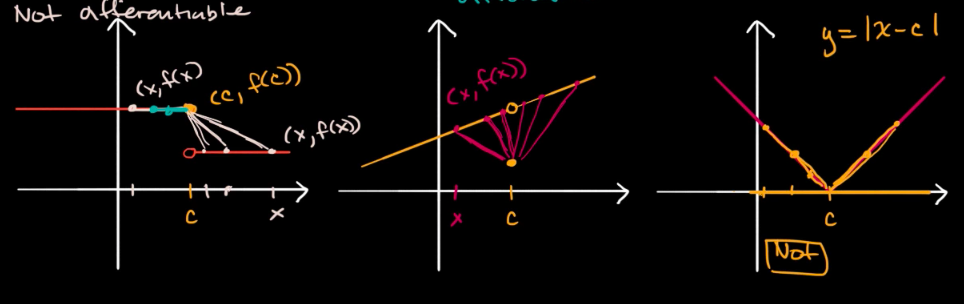
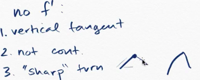

#  ❖ Differentiability

> "If the point of a function IS differentiable, then it MUST BE continuous at the point."

Example of NOT `differentiable` points:

You can see, if the point DOES NOT have `limit`, it's NOT DIFFERENTIABLE. 
In another word, the point is not CONTINUOUS, it's `Jump Discontinuity`, or `Removable Discontinuity`, or any type of discontinuities.

## 「NOT」 differentiable situations

- Vertical Tangent (∞)
- Not Continuous
- Two sides' limits are different

## 「Vertical Tangent」

We know that the `Slope of Vertical Tangent` is **UNDEFINED**, 
on the contrary:
**IT IS A VERTICAL TANGENT, IF:**
- The derivative `dy/dx = undefined`, or
- The `denominator of derivative's expression = 0`.

## 「Horizontal Tangent」

**It's a Horizontal Tangent, if:**
- `dy/dx = 0`.

