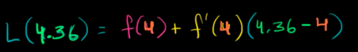
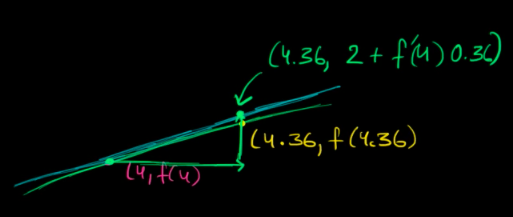
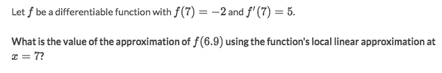
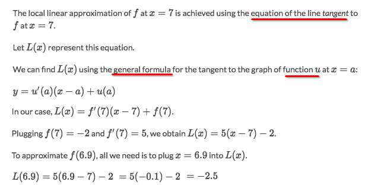

# 「Local linearity」 & 「Linear approximation」

> `Local linearity` is for approximating of a point's value by its near known point.

Just think of a curve, a good way to approximate its Y-value, is to find another known point near it, and make a line connecting two points, then gets the value by linear equation.

[Refer to Khan academy lecture.](https://www.khanacademy.org/math/ap-calculus-ab/ab-derivative-intro/modal/v/local-linearization-intro)

### Example

Solve:

