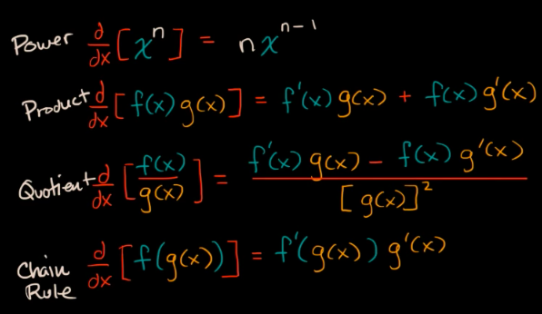
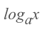
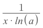
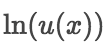
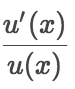
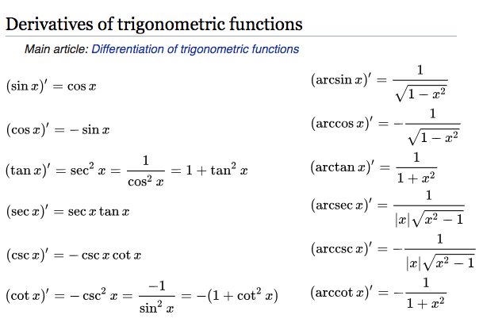

# Basic 「Differential Rules」

> [`Jump over to Basic Integral Rules`](https://github.com/solomonxie/solomonxie.github.io/issues/49#issuecomment-395356656)

[▼Refer to Math is fun: Derivative Rules](https://www.mathsisfun.com/calculus/derivatives-rules.html)

Rules | Function | Derivative
-- | -- | --
Constant | c | 0
With constant | c·f | c·f’
Power Rule | xⁿ | n·xⁿ⁻¹
Sum Rule | f + g | f’ + g’
Difference Rule | f - g | f’ − g’
Product Rule | f · g | fg’ + f’ g
Quotient Rule | f / g | (f’g − g’f ) / g²
Reciprocal Rule | 1 / f | −f’ / f²
Chain Rule | f(g(x)) | f’(g(x)) · g’(x)
Exponent Rule | eˣ | eˣ
                     | aˣ | aˣ · ln(a)
Log Rule |  |
Natural Log Rule | ln(x) | 1/x
Exponential Rule |  | 
Trig Rules    | sin(x) | cos(x)
                     | cos(x) | −sin(x)
                     | tan(x) | sec²(x) = 1/cos²(x)
                     | sec(x) | sec(x)·tan(x)
                     | csc(x) | -csc(x)·cot(x)
                     | cot(x) | −csc²(x) = -1/sin²(x) = -(1+cot²(x))
Inverse Trig Rules | arcsin(x) | 1/√(1−x²)
                               | arccos(x) | −1/√(1−x²)
                               | arctan(x) | 1/(1+x²)

[▼Refer to Wiki: Differentiation rules](https://en.wikipedia.org/wiki/Differentiation_rules)

