# Chain Rule

> One of the **core principles** in Calculus is the Chain Rule.

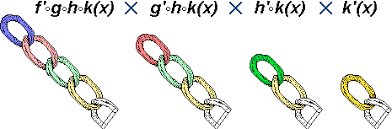

[Refer to Khan academy article: Chain rule](https://www.khanacademy.org/math/ap-calculus-ab/ab-derivative-rules/modal/a/chain-rule-review)
[`▶ Proceed to Integral rule of composite functions: U-substitution`](https://github.com/solomonxie/solomonxie.github.io/issues/49#issuecomment-395677669)

It tells us how to differentiate `Composite functions`.

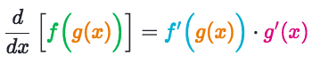

**It must be composite functions, and it has to have `inner & outer` functions, which you could write in form of `f(g(x))`.**
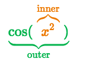

### Common 「mistakes」

- Not recognizing whether a function is composite or not
- Wrong identification of the inner and outer function
- **Forgetting to multiply by the derivative of the inner function**
- Computing `f(g(x))` wrongly:
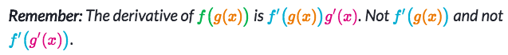

### How to identify 「Composite functions」

> Seems a basic algebra101, but actually a quite tricky one to identify.

[Refer to Khan lecture: Identifying composite functions](https://www.khanacademy.org/math/ap-calculus-ab/ab-derivative-rules/modal/v/recognizing-compositions-of-functions)

The core principle to identify it, is trying to re-write the function into a nested one: `f(g(x))`. If you could do this, it's composite, if not, then it's not one.

### Examples
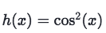
It's a composite function, which the inner is `cos(x)` and outer is `x²`.

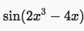
It's a composite function, which the inner is `2x³-4x` and outer is `sin(x)`.

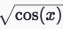
It's a composite function, which the inner is `cos(x)` and outer is `√(x)`.

## Two forms of 「Chain Rule」

The general form of Chain Rule is like this:
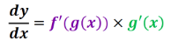

But the Chain Rule has another **more commonly used** form:
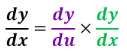

Their results are exactly the same.
It's just some people find the first form makes sense, some more people find the second one does.

### Example
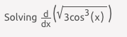
Solve:
[Refer to Symbolab worked example.](https://www.symbolab.com/solver/step-by-step/%5Cfrac%7Bd%7D%7Bdx%7D%5Cleft(sqrt%5Cleft(3cos%5E%7B3%7D%5Cleft(x%5Cright)%5Cright)%5Cright))

## Chain rule for 「exponential function」

Formula:
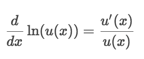

Because:
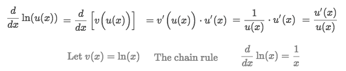

### Example
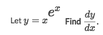
Solve:
- Apply the `Log power rule` to simplify the exponential function:
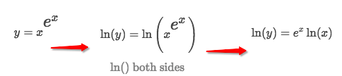
- Differentiate both sides:
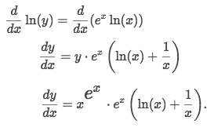

