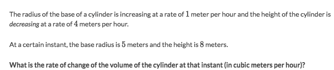
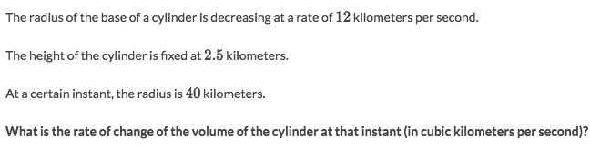
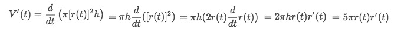
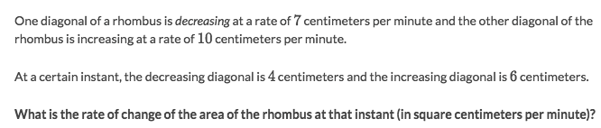
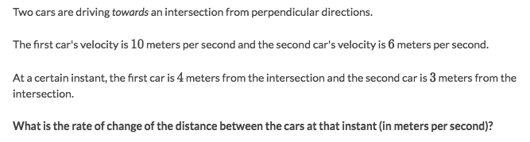
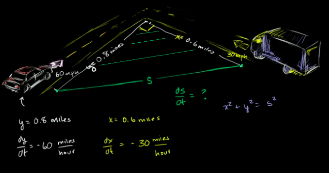
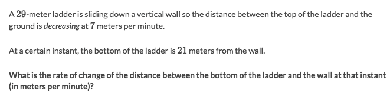
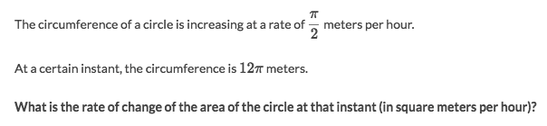

#  ❖ Related Rates

Just so you know, `related rates` is actually the **Application** of `Implicit Differentiation` by using Chain Rule in the form of `dy/dx = dy/du * du/dx`.

Btw, at Khan academy it's called the `Differentiate related functions`.

[Refer to Khan lecture.](https://www.khanacademy.org/math/ap-calculus-ab/ab-derivatives-advanced/modal/v/differentiating-related-functions-intro)
[Refer to video by KristaKingMath: Related rates](https://www.youtube.com/watch?v=Vi5KBiXg0Co)
[Refer to video by The Organic Chemistry Tutor: Introduction to Related Rates](https://www.youtube.com/watch?v=I9mVUo-bhM8&t=0s&index=78&list=PL0o_zxa4K1BWYThyV4T2Allw6zY0jEumv)

Strategy:
- Abstract every given condition algebraically, e.g. `s(t), s'(t), V(t), V'(t)...`
- Find a proper equation to **CONNECT** all these given conditions
- Differentiate both sides of equation, with using the Chain rule.
- Take back the given values to the Differentiated equation to get the result.

## Example: 「Change of volumes」

[Refer to previous note of Implicit Differentiation.](https://github.com/solomonxie/solomonxie.github.io/issues/49#issuecomment-390174936)

Solve:
- Write out all conditions algebraically:
    - `r'(t)=1`
    - `r(t)=5`
    - `h'(t)=-4`
    - `h(t)=8`
    - `V(t) = π·r²·h`
- So they're asking for `V'(t)`, it then becomes `V'(t) = π·d/dt (r²·h)`
- Apply `Product rule` & `Chain rule` then substitute: `V'(t) = π((r²)'·h + r²h') = π(2r'·r + r²·h') = -20π`
Notice that: `(r²)'` is a composite function, so you want to apply the Chain rule, `=2r·r'`

## Example: 「Change of volumes」

Solve:
- From the given conditions, we got that `r'(t)=-12`, `r(t)=40` and `h=2.5`.
- We know the equation of cylinder's volume is: `V= π·[r(t)]²·h`
- Differentiate both side of the equation to get:

- Take back all the known values into the equation get `V'(t)=-2400π`

## `Example: Change of area`

Solve:
- Write out all conditions algebraically:
    - `d₁'(t) = -7`
    - `d₁(t) = 4`
    - `d₂'(t) = 10`
    - `d₂(t) = 6`
    - `A(t) = (d₁·d₂)/2`
- So it's asking for instantaneous rate of change, then it is `A'(t) = (d₁'·d₂ + d₁·d₂')/2`
- Apply the Product rule only, to get `A'(t) = -1`.

## Example: 「Pythagorean Theorem」

[Refer to Khan academy lecture: Related rates: Approaching cars](https://www.khanacademy.org/math/ap-calculus-ab/ab-applications-derivatives/ab-related-rates/v/rate-of-change-of-distance-between-approaching-cars)

Solve:
- It's a problem to calculate two objects' dynamic absolute distance: it's getting closer and closer until distance become `0`, which means they crashes at `0`.
- Write down all the conditions algebraically:
    - `c₁'(t) = -10`
    - `c₁(t) = 4`
    - `c₂'(t) = -6`
    - `c₂(t) = 3`
    - `D(t) = √(c₁²+c₂²)`
- So `D'(t) = d/dt · (√(c₁²+c₂²)) = (2c₁'c₁+2c₂'c₂)/(2√(c₁²+c₂²))`

## Example: 「Sliding ladder」

## Example: 「multiple composite」

Solve:
- Write down all the conditions algebraically:
    - `S'(t) = π/2`
    - `S(t) = 12π`
    - `S = 2π·r`, which means `r = S/2π`
    - `A(t) = π·r²`
- So `A'(t) = d/dt · (π·r²) = 2π·r·r' = 2π·6·(S/2π)' = 6S' = 3π`
