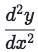
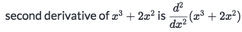
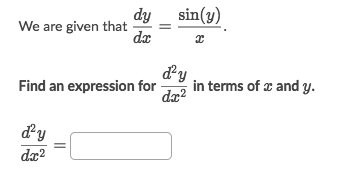
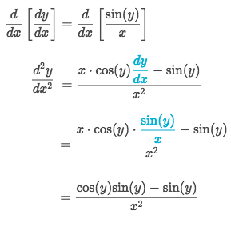
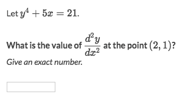
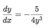
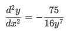
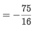

#  ❖ Higher Order Derivatives

- First order derivative: `f'(x)` or `dy/dx`, also called "First Derivative"
- Second order derivative: `f''(x)` or `d²y/dx²`, also called "Second Derivative"
- ...

## 「Second derivatives」

The second derivative of a function is simply the derivative of the function's derivative.

Notation:
Leibniz's notation for second derivative is:

## Second derivatives of 「implicit equations」

[`▶ Jump back to previous note on Implicit Differentiation`](https://github.com/solomonxie/solomonxie.github.io/issues/49#issuecomment-390174936)
[`▶ Practice at Khan academy: Second derivatives (implicit equations)`](https://www.khanacademy.org/math/ap-calculus-ab/ab-differentiation-2-new/ab-3-6/e/second-derivatives-implicit-equations)

[`▶ Online calculator for 2nd Derivative of Implicit equations`](https://www.symbolab.com/solver/step-by-step/implicit%20%5Cfrac%7Bd%5E%7B2%7Dy%7D%7Bdx%5E%7B2%7D%7D%2C%20%20y%5E%7B4%7D-2x%3D14)

### Example

Solve:

### Example

Solve:
- The first derivative is:

- The second derivative is:

- Plug in `y=1`, and get:

