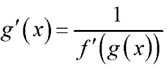
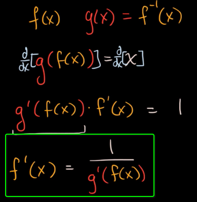
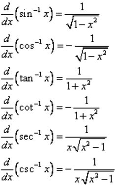
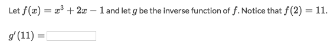
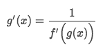
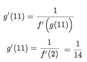

# Derivative of Inverse functions

> IT'S DERIVED FROM THE `CHAIN RULE`:

## Derivative of 「Inverse Trig functions」

### Example

Solve:
- For solving this `derivative of an inverse function`, we'd use the identity:

- Apply it we get:

