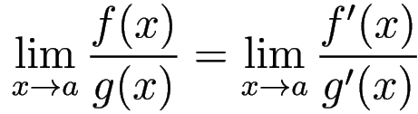
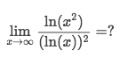
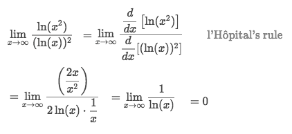
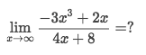
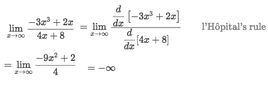
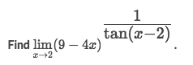
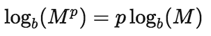
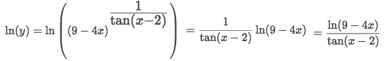
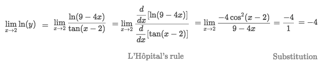
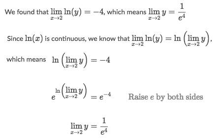

#  ❖ L'Hopital's Rule [DRAFT]

`L`Hopital's Rule helps us to find the limit of an `Undefined` limits, like `0/0`, `∞/∞` and such.
It's quite simple to apply and very convenient to solve some problems.

[Refer to `L'Hôpital's rule`](https://en.wikipedia.org/wiki/L%27H%C3%B4pital%27s_rule)

> [`▶ Jump back previous note on: Asymptote of Rational Expressions`](https://github.com/solomonxie/solomonxie.github.io/issues/44#issuecomment-374894945)
[`▶ Practice at Khan academy: Disguised derivatives`](https://www.khanacademy.org/math/ap-calculus-bc?t=practice)

From my experience, the L'Hopital's Rule is so often been used that we didn't even realize. Actually it's been used almost every time when we are to evaluate the **LIMITS OF RATIONAL EXPRESSIONS**.

### Example of 「0/0」

### Example of 「∞/∞」
1. Find the limit:

Solve:

2. Find the limit:

Solve:

### Example of 「1^∞」

## L'Hopital Rule for 「Composite functions」

### Example of composite exponential function

Solve:
- Direct plug in the `x=2` and get `limit = 1^∞`, which is an indeterminate form
- So we're gonna apply the `Log Power Rule` to take down the power:

- We use **Natural Log** for doing this:

- And now we can apply the `L'Hopital Rule` for `ln(y)`:

- From `ln(y)` we could get `limit of y`:

