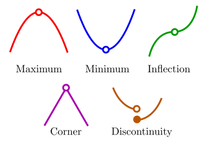
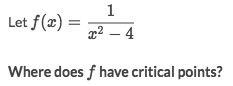
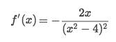
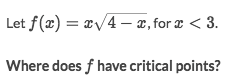
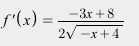

#  ❖ Critical points

[Refer to PennCalc Main/Optimization](http://calculus.seas.upenn.edu/?n=Main.Optimization)

For analyzing a function, it's very efficient to have a look at its `Critical points`, which could be classified as `Extrema`, `Inflection`, `Corner`, and `Discontinuity`.

## How to find 「critical points」

Strategy:
- Knowing that `f(x)` has critical point `c` when `f'(c) = 0` or `f'(c) is undefined`
- Differentiate `f(x)` to get `f'(x)`
- Solve `c` for `f'(c)=0 & f'(c) undefined`

[Refer to Symbolab's step-by-step solution.](https://www.symbolab.com/solver/step-by-step/critical%20points%2C%20f%5Cleft(x%5Cright)%3Dx%5Ccdot%20sqrt%5Cleft(4-x%5Cright))

### Example

Solve:
- See that original function `f(x)` is undefined at `x = 2 or -2`
- Differentiate `f(x)` to get `f'(x)`:

- Solve `f'(x)=0` only when `x=0`.
- `f'(x)` is undefined when `x=2 or -2`, as the same with `f(x)` so it's not a solution.

### Example

Solve: [Refer to Symbolab step-by-step solution.](https://www.symbolab.com/solver/step-by-step/critical%20points%2C%20f%5Cleft(x%5Cright)%3Dx%5Ccdot%20sqrt%5Cleft(4-x%5Cright))
- Differentiate `f(x)` to get `f'(x)`:

- `f'(x)` is **undefined** when `x > 4`
- Solve `f'(x)=0` get `x = 8/3`
- So under the given condition, only `x=8/3` is the answer.
