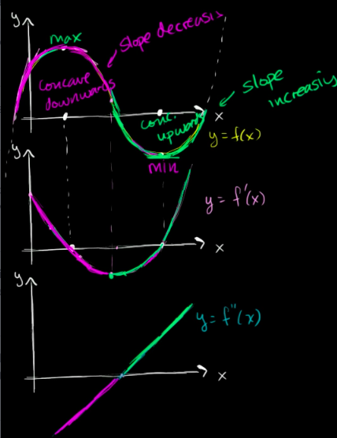
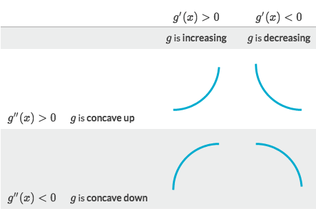
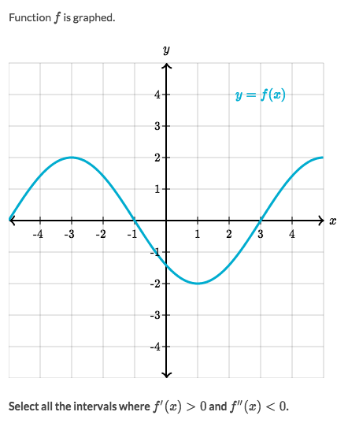

# Concavity

[Refer to Khan academy: Concavity introduction](https://www.khanacademy.org/math/ap-calculus-ab/ab-derivatives-analyze-functions/modal/v/concavity-concave-upwards-and-concave-downwards-intervals)

Two types of concavity: `Concave Up` & `Concave Down`.

## Understand function by 「1st & 2nd Derivative」

## Identify 「concavity」 by using 「Second Derivative」

### Example

Solve:
- `f'(x) > 0` means we're to find the INCREASING interval on the graph
- `f''(x) < 0` means we'll be focusing on the CONCAVE UP shape only
- So it's about the interval of`(-4, -3)` and `(3, 4)`.

