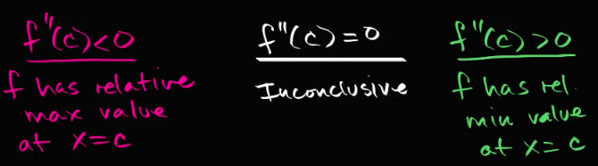
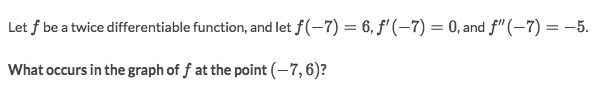
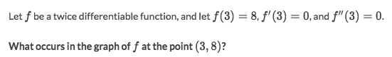
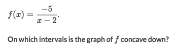

# Second Derivative Test

### Example

Solve:
- `f'(c) = 0` means `c` is a critical point, could be max, min, inflection.
- `f''(c) < 0` means around point `c` it's a Downward Concave.
- Conclusion then is that `c` is a maximum point.

### Example

Solve:
- `f'(c) = 0` means `c` is a critical point, could be max, min, inflection.
- `f''(c) = 0` means it's either a Concave up or down, we don't know yet.
- So the answer is "No enough information to tell."

### Example

Solve:
- It's Concave Down when `f''(x) < 0`
- Find formula of `f''(x)` and set inequality equation `f''(x)<0` and solve to get `x > 2`.
