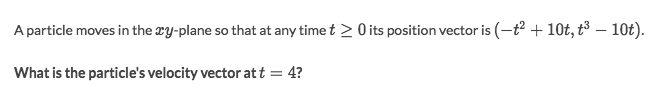
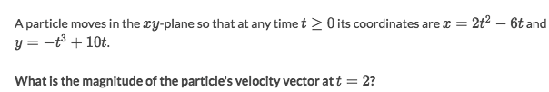
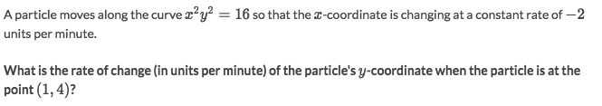
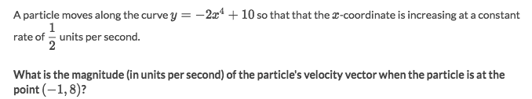

# Planar motion (Derivative of vectors)

It's still the `Motion problem` but the object not only moves on the X-axis but move in a **PLANE**, with X-coordinate and Y-coordinate.
So it becomes **differentiation of vectors**.
But the differentiation steps are almost the same.

Here are some algebraical expressions:
- Position: `P(t) = (x, y)`
- Velocity: `v(t) = P'(t) = (x', y')`
- Acceleration: `a(t) = v'(t) = P''(t) = (x'', y'')`

[Jump to do the Khan academy practice.](https://www.khanacademy.org/math/ap-calculus-bc/bc-applications-derivatives/modal/e/planar-motion-differential-calc)

### Example

Solve:
- Write down all the conditions algebraically:
    - Position: `P(t) = (x, y) = (-t²+10t, t³-10t)`
    - Velocity: `v(t) = P'(t) = (x', y') = (-2t+10, 3t²-10)`
    - `t=4`
- Substitute to get `v(4) = (2, 38)`

### Example

Solve:
- `P(t) = (2t²-6t, -t³+10t)`
- `v(t) = P'(t) = (4t-6, -3t²+10)`
- `v(2) = (2, -2)`
- `|v(2)| = √(4+4) = 2√2`

### `Example: Motion along a curve`

[Refer to Khan academy's quizzes for these practices](https://www.khanacademy.org/math/ap-calculus-bc/bc-applications-derivatives/modal/e/motion-along-a-curve-differential-calc)
Solve:
- Position: `P(t) = (x, y)`
- The rate of change means velocity: `v(t) = P'(t) = (x', y')`
- Since `x' = -2`, so it becomes `v(t) = (-2, y')`. How to get the `y'`?
- We could find an equation `x²y²=16` helps us to get `y'`.
- It's easier to do `implicit differentiation` than explicit one: 
`(x²y²)'=(16)' -> 2x·x'·y² + x²·2y·y' = 0 -> -4xy² + x²·2y·y' = 0 -> y' = 2y/x`
- Substitute `(1,4)` to the `y`'s rate of change to get `y' = 2*4/1 = 8`

### Example

Solve:
- `P(t) = (x, y)`
- `x' = 1/2`
- `v(t) = P'(t) = (x', y') = (1/2, y')`
- `y'(t) = d/dt (-2x⁴+10) = -2·4·x³·x' = -4x³`
- `y'(x=-1, y=8) = -4(-1)³ = 4`
- So `v(t) = (1/2, 4)`
- `|v(x=-1, y=8)| = √(1/4 + 16)`
