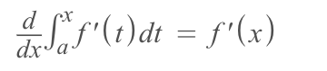
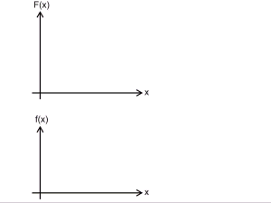
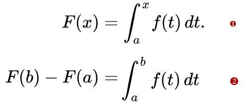
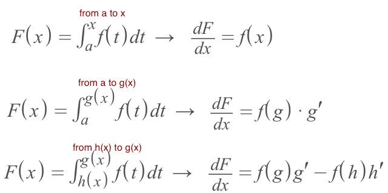
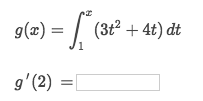
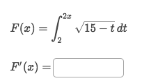
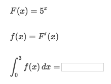
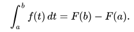
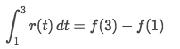
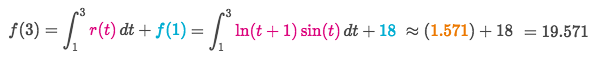

#  ❖ Fundamental Theorem of Calculus (FTC)

> This is somehow dreaded and mind-blowing.  But it's the **only** thing to relate the `Differential Calculus` & `Integral Calculus`.

It's so much clearer if you see the function in the middle of integration as a `derivative`.

Notice that:
In this theorem, the lower boundary `a` is completely "ignored", 
and the unknown `t` directly changed to `x`.

[►Refer to Khan academy: Fundamental theorem of calculus review](https://www.khanacademy.org/math/ap-calculus-bc/bc-antiderivatives-ftc/modal/a/fundamental-theorem-of-calculus-review)
[`►Jump over to have practice at Khan academy: Contextual and analytical applications of integration (calculator active).`](https://www.khanacademy.org/math/ap-calculus-ab/ab-applications-of-integration-new/ab-8-14/e/applications-of-integration-calculator-active)

## 「1st FTC」 & 「2nd FTC」

The Fundamental Theorem of Calculus could actually be used in two forms. They have different use for different situations.

 (**Notice that boundaries & terms are different**)

## How to 「Differentiate Integrals」

We could **CONVERT** the `integral formula` to `Differential formula`, by using the `fundamental theorem of calculus`, and use the Rules we've learnt to solve the differential equations.

[Refer to video from Krista King: PART 2 OF THE FUNDAMENTAL THEOREM OF CALCULUS!](https://www.youtube.com/watch?v=T-J7SkiE39Y&list=PLJ8OrXpbC-BMObozItpbiZ8f2pjf3qS9M&index=16)

We got different strategies for different boundaries situation:
- A variable and a number.
- A function and a number.
- Two functions.

▼ Here is formulas for different **boundaries** of integration:

### Example

Solve:
- It's to apply the `boundary situation strategy` of `A variable & a number`: `G'(x) = g(x)`
- Assume the function in the middle of integral is `G'(x) = 3x²+4x`
- Since it's asking for `g'(x)`, so it's differentiate the Integral: `d/dx ʃ G'(x) dt` expression
- So `g'(2) = G'(x) = 3x²+4x = 20`

### Example

Solve:
- According to the different `Boundary situation strategies`, here we apply the `A function & a number` strategy: `F'(x) = f[g(x)] · g'(x)`
- So `F'(x) = √(15 - 2x) · (2x)' = 2√(15-2x)`

### Example

Solve:
- It's asking you to apply the FTC in form of `d/dx ʃ f'(x) dx = f(b) - f(a)`
- So it becomes calculating `F(3) - F(0) = 125 - 1 = 124`

### Example

Solve:
- We could use the `Second Fundamental Theorem of Calculus`:

- which in this case is:

- And we move the known terms to one side and keep the asking term at another side:

