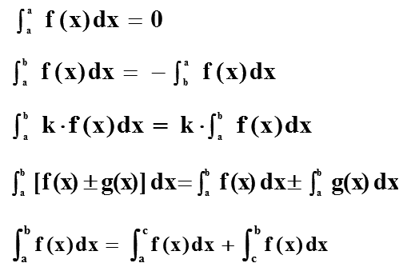
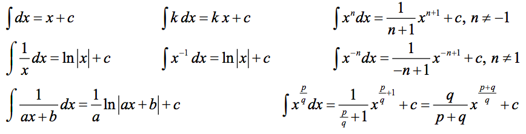
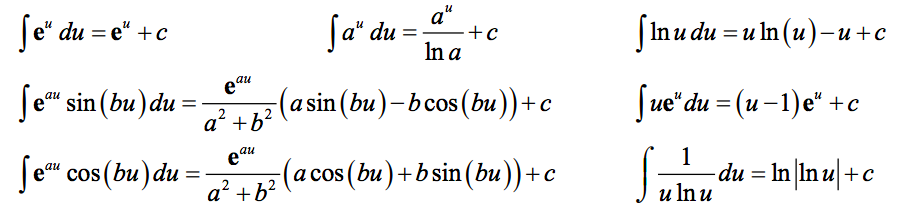
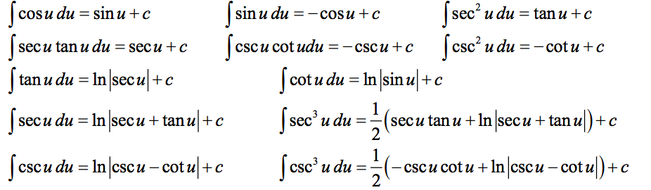
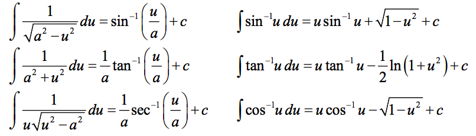
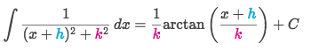
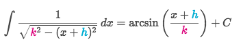

# Basic 「Integral Rules」

Remember there're a bunch of `Differential Rules` for calculating derivatives.
And for integration we need to reverse them.

[Refer to Lamar's math book: Common Derivatives and Integrals [PDF]](https://github.com/solomonxie/solomonxie.github.io/files/2088979/Common_Derivatives_Integrals.pdf)
[Refer to Khan academy article: Common integrals review](https://www.khanacademy.org/math/ap-calculus-bc/bc-antiderivatives-ftc/bc-common-indefinite-int/a/common-integrals-review)

> [`Jump back to review the basic differential rules`](https://github.com/solomonxie/solomonxie.github.io/issues/49#issuecomment-390102382)

## Basic Rules

## Reversed 「Polynomial Rules」

## Reversed 「Exponential / Log Rules」

## Reversed 「Trig Rules」

## Reversed 「Inverse Trig Rules」

## 「Special Rules」

