# Calculate Integrals [DRAFT]

## Calculate 「Indefinite Integrals」

### Example
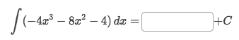
Solve:
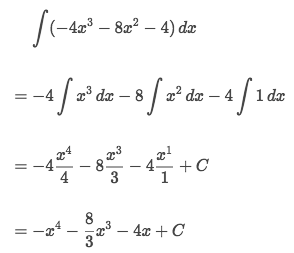

## Integration using 「completing the square」

### Example
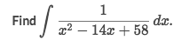
Solve:
- Rewrite it to this form:
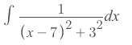
- Use the special arctan rule to solve it, and get:
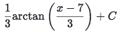

### Example
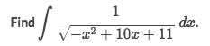
Solve:
Solve:
- Rewrite it to this form:
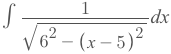
- Use the special arctan rule to solve it, and get:
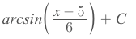

## Calculate 「Definite Integrals」

### Example
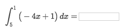
Solve:
Don't get confused when you see the Upper boundary is smaller than the Lower one.

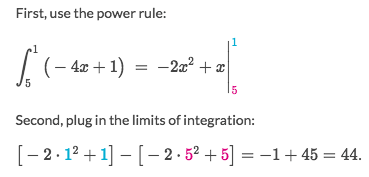

### Example (piecewise integration)
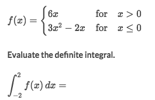
Solve:
The key is to seperate the intervals and integrate them piece by piece.
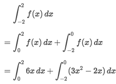

### Example (Absolute value)
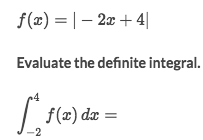
Solve:
- Splitting up the absolute value, and notice that the absolute value function is a piecewise function. Here we have that:
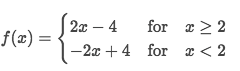
- Splitting up the definite integral:
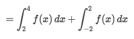
- Evaluating each piece:
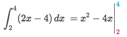
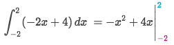
- Answer is 20.

