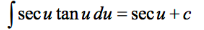
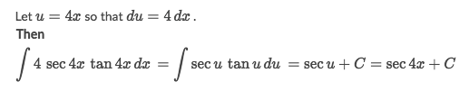
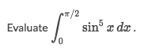
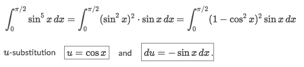
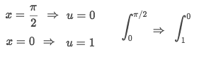
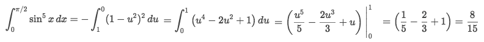
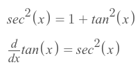
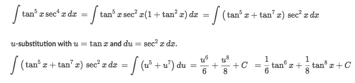

# Integration using 「Trig identities」

> The goal is to convert the **multiplication** of terms to be **addition** of simple terms.

[`▶ Cheatsheet on previous note: Basic Integral Rules`](https://github.com/solomonxie/solomonxie.github.io/issues/49#issuecomment-395356656)
[`▶ Cheatsheet on previous note:Basic Differential Rules`](https://github.com/solomonxie/solomonxie.github.io/issues/49#issuecomment-390102382)
[`▶ Cheatsheet on previous note: All trig identities`](https://github.com/solomonxie/solomonxie.github.io/issues/44#issuecomment-377684464)
[`▶ Jump back to previous note on: U-substitution → Chain Rule`](https://github.com/solomonxie/solomonxie.github.io/issues/49#issuecomment-395677669)

[Refer to Khan academy: Integrating using trigonometric identities](https://www.khanacademy.org/math/integral-calculus/ic-integration#ic-integration-with-trig-identities)

### Example

Solve:
- We can identify there's a `Integral trig rule` we can apply on this problem:

- Therefore we're gonna organize it a bit with `u-substitution` and get the answer:

### Example

Solve:
- This integrand has an **odd** power of `sin(x)`, so we're gonna leave `sin(x)` alone and make an  **even** power for `sin(x)`, then make `u-substitution` upon it:

- And also we need to change the boundaries for the integral:

- Now we can start to integrate:

### Example

Solve:
- We're gonna use a `trig-integral-rule` and a `trig identity`:

- Then apply them:

