# Improper Integral

After learning `Definite Integral`, `Indefinite Integral`, now it's `Improper Integral`.
The major difference between them is their **`Boundaries`**.

> The `improper integral` means the integral's boundary or boundaries are infinite, **∞** (or -∞).

[Refer to Khan academy: Introduction to improper integrals](https://www.khanacademy.org/math/ap-calculus-bc/bc-antiderivatives-ftc/modal/v/introduction-to-improper-integrals)
[Refer to Improper Integrals (KristaKingMath)](https://www.youtube.com/watch?v=DUowajlKIKA)

It looks so fearful yet not too hard to understand.

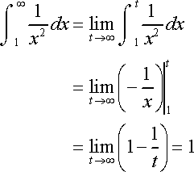

## 「Types」 of Improper Integral

[Refer to video from ProfRobBob: Improper Integrals 5 Examples](https://www.youtube.com/watch?v=dzOxbMnaZLo)

There're 6 cases of different improper integral:
- Case 1: From a `constant` to `positive infinity`.
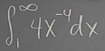
- Case 2: From `negative infinity` to a `constant`.
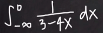
- Case 3: From `negative infinity` to `positive infinity`.
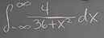
- Case 4: From `0` to `e`.
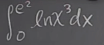
- Case 5: From a `constant` to a `constant`, but has an `infinite discontinuity`.
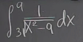
- Case 6: 

## 「Convergent」 & 「Divergent」

We can call an `improper integral`:
- `Divergent`: When the **limit** of the improper integral **DOES NOT EXIST**.
- `Convergent`: When the **limit** of the improper **integral EXISTS**.

## Solve 「Improper Integrals」

Basic Strategy:
- Replace the `infinite` as a variable, etc. `t`
- Rewrite the expression as taking the limit of the Integral, whereas the `t → ∞`
- Calculate the Integral with a normal variable first, and gets the result function.
- Calculate the limit of the function

###  「Type 1」
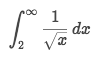
Solve:
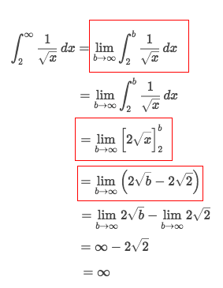

### 「Type 2」
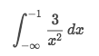
Solve:
- Rewrite the improper integral to limit form:
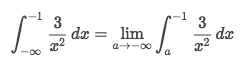
- Do the basic calculation.
- The key point is:
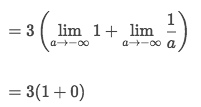

### 「Type 5」
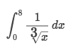
Solve:
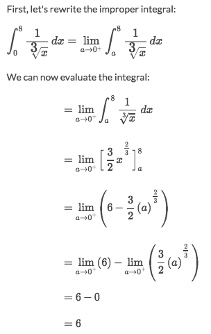

