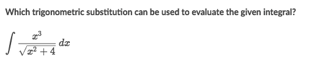
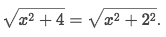
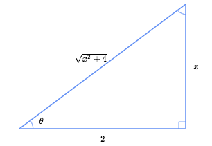
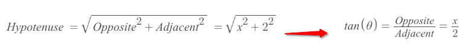
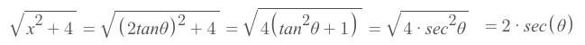
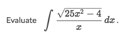

# 「Trig-substitution」 → Trig Rule

> The goal is to simplify expression by **CONVERTING** terms of `x` into simplified expression in terms of  `θ`.

How to do this?
We can identify some trigonometric patterns in the expression and apply the `Pythagorean Theorem`.

[`▶ Cheatsheet on previous note: Basic Integral Rules`](https://github.com/solomonxie/solomonxie.github.io/issues/49#issuecomment-395356656)
[`▶ Cheatsheet on previous note: Basic Differential Rules`](https://github.com/solomonxie/solomonxie.github.io/issues/49#issuecomment-390102382)
[`▶ Cheatsheet on previous note: All trig identities`](https://github.com/solomonxie/solomonxie.github.io/issues/44#issuecomment-377684464)
[`▶ Back to previous note on: U-substitution → Chain Rule`](https://github.com/solomonxie/solomonxie.github.io/issues/49#issuecomment-395677669)

[`▶ Practice at Khan academy: Trigonometric substitution`](https://www.khanacademy.org/math/integral-calculus/ic-integration/modal/e/integration-using-trigonometric-substitution)

[Refer to Khan academy: Introduction to trigonometric substitution](https://www.khanacademy.org/math/integral-calculus/ic-integration/modal/v/introduction-to-trigonometric-substitution)

### Example

Solve:
- In this expression, we can easily identify there is a **"pythagorean-like terms"**: 

- We can see `x` and `2` as two sides of a triangle:

- Once we identify the pattern, we can easily get some information out of it in terms of `θ`:

- From the information `tan(θ)=x/2` we can get the relationship between `x & θ`, which is: `x=2tan(θ)`
- And now we can **convert** the original expression to be in terms of `θ`:

### Example

Solve:
...
