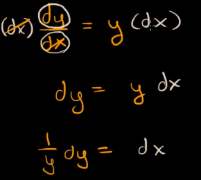
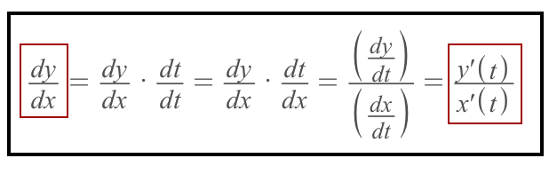
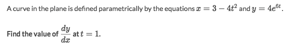
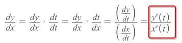
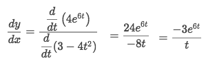
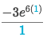
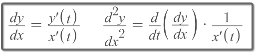
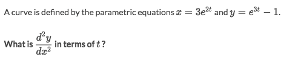
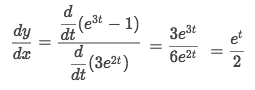
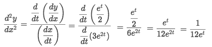

# 「Parametric Equations」 Differentiation

[►Refer to Khan academy: Parametric equations differentiation](https://www.khanacademy.org/math/ap-calculus-bc/bc-advanced-functions-new/bc-9-1/v/parametric-function-differentiation)
[`►Jump over to have some practice at Khan academy.`](https://www.khanacademy.org/math/ap-calculus-bc/bc-advanced-functions-new/bc-9-1/e/differentiate-parametric-functions)

## Why can we operate 「dy/dx」 algebraically?

[Refer to Khan academy: Addressing treating differentials algebraically](https://www.khanacademy.org/math/ap-calculus-bc/bc-diff-equations/modal/v/addressing-treating-differentials-algebraically)

> [Jump back to previous note: How to understand `dy/dx`](https://github.com/solomonxie/solomonxie.github.io/issues/49#issuecomment-389389887)

## Differentiate 「Parametric Equations」

▼How to take derivative of a `parametric differential equation`?

### Example

Solve:
- Let's do some trick to `dy/dt` and use this one instead:

- Substitute the derivatives back:

- Plug in `t=1` to get the answer:

## 「Second derivatives」 of Parametric functions

### Example

Solve:
- Follow the rule, we got the first derivative:

- And let's apply the rule for second derivative:

