# Separable 「Differential Equations」

This section is an essential method for solving differential equations.
Especially about the `initial condition`, it is the critical information for getting the original function.

### Example
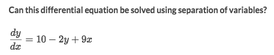
Solve:
- No we can't. Because:
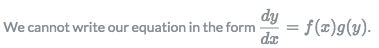

### Example
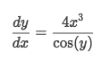
Solve:
- First to transfer same terms to the same side.
- Then take integral of each side
- Operate to get `y`
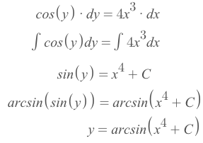

### Example
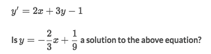
Solve:
- We could easily get the derivative of second equation is `y' = -2/3`.
- Let's see if two of the derivatives are equal by substitute back the `y` expression:
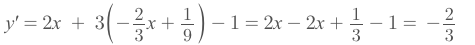
- Clearly they're equal. So the answer is `YES`.

### Example
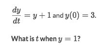
Solve:
- Move the same terms to each side:
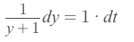
- Take integral of both side:
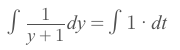
- Get that:
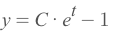
- Plug in `y(0) = 3` to get `C=4`, so the equation then be:
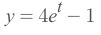
- Set `y=1` and get `t = ln(1/2) = -ln(2)`

## Exponential model equations

[`►Jump to Khan academy for practice`](https://www.khanacademy.org/math/ap-calculus-ab/ab-differential-equations-new/ab-7-8/e/exponential-model-equations)

[►Refer to Khan academy: Worked example: exponential solution to differential equation](https://www.khanacademy.org/math/ap-calculus-ab/ab-differential-equations-new/ab-7-8/v/exponential-solution-to-differential-equation)

### Example
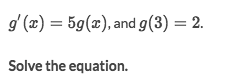
Solve:
- Rewrite the equation, and take integral of both side:
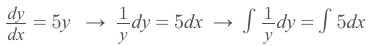
- And we get:
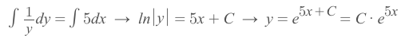
- Let's plug in `g(3)=2` to solve for `C`:
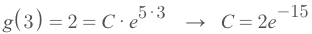
- Take `C` back and get the equation for `g(x)`:
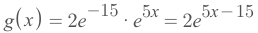

### Example
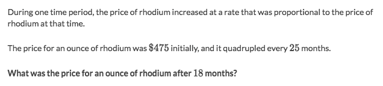
Solve:
- We are told that the rate of change of P is proportional to P, which means in Math is:
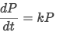
- It's clear that is a `Differential Equation`, and we rewrite them and take integral of both side to get:
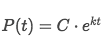
- Solve for `C`:
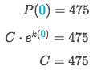
- Solve for `k`:
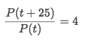
- get the `k`:
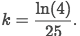
- Now we have the full equation, and get the result:
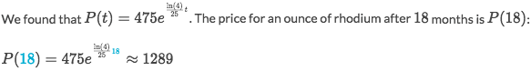

