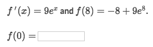
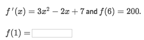
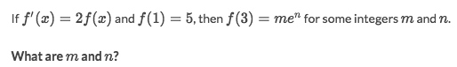
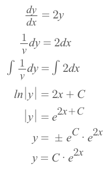
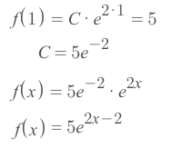
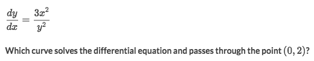
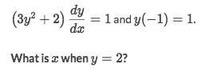
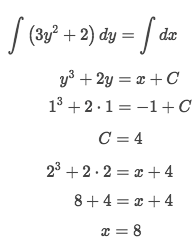

# Specific antiderivatives

Normally the antiderivative is in form of `f(x) +C`.
But actually we could use some additional information to get the `C` and get the function only in terms of `x`.
And we often call the "additional information" as **`Initial Conditions`**, or `f₀(x)`.

### Example

Solve:
- We could Integrate the `f'(x)` to get `f(x) = 9eˣ + C`.
- Since `f(8) = 9e⁸ - 8`, we could easily see that `C = -8`
- So the function under this condition would be: `f(x) = 9eˣ -8`
- Then we will get the result `f(0) = 9*1 - 8 = 1`.

### Example

Solve:
- We could integrate `f'(x)` to get `f(x) = x³ - x² + 7x +C`
- Since `f(6)=200`, so we could substitute `6` into `f(x)`:
- `f(6) = 6³ - 6² + 7*6 +C = 200` which results `C = -22`
- So the function under this condition should be `f(x) = x³ - x² + 7x - 22`
- And `f(1) = 1³ - 1² + 7*1 - 22 = -15`

### Example (Separable equations with specific solutions)

Solve:
- It looks confusing, but let's assume `f(x)` as `y` so `dy/dx = 2y`
- Separate differential equations to get `dy/y = 2dx`
- Take integral of both sides: 

- Since `f(1) = 5`, so:

- And `f(3) = 5e⁴`, which means `m = 5, n = 4`

### Example

Solve:
Hint: `f(0) = 2`

### Example

Solve
Hint: Don't need to solve `y` completely.

