# 「Polar Curve」 Functions (Differential Calc)

[`▶ Practice at Khan academy.`](https://www.khanacademy.org/math/ap-calculus-bc/bc-advanced-functions-new/bc-9-7/e/differentiate-polar-functions)

[Refer to Khan academy: Polar functions derivatives](https://www.khanacademy.org/math/ap-calculus-bc/bc-advanced-functions-new/bc-9-7/v/derivatives-in-polar-coordinates)
 
> [`▶ Proceed to: Area of Polar Curves (Integral Calc)`](https://github.com/solomonxie/solomonxie.github.io/issues/49#issuecomment-398657472)

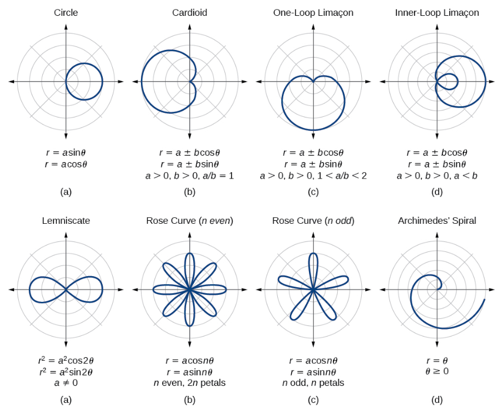

> In the `Polar World`, 
instead of the relationship between `y & x`, 
the function is now representing the relationship between `Radius & Angle`, 
which could be presented as:

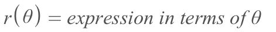

## Finding the right 「boundaries」

> The most tricky part in Polar system, is finding the right boundaries for `θ`, and it will be the first step for polar integral as well.

## Differentiate 「Polar Functions」

**Taking derivative of Polar function** is actually **DIFFERENTIATING PARAMETRIC FUNCTION**.
To take the derivative we need to:
- Convert the `Polar function` in terms of `x & y`:
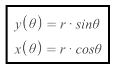
- Take derivative of the parametric function.

### Example
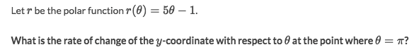
Solve:
- Since it's asking for the `Rate of change of y-coordinate`, so we convert the polar function to `rectangular function`:
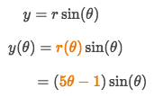
- And we take the derivative `dy/dΘ`:
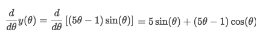
- Plug in the point `Θ=π` and get:
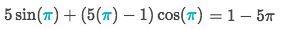

## 「Tangents」 to Polar curves
Steps:
- Find the slope `dy/dx`
- Convert the polar function to get the `x(θ)` and `y(θ)` parametric equations
- Solve `dy/dx` and get the slope
- Plug in the point's information to solve for `x & y`
- Get the equation of the line (tangent).

### Example
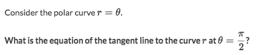
Solve:
- To find the tangent line, we need to get the slope first, which is `dy/dx`.
- And `dy/dx` would be a `parametric problem`:
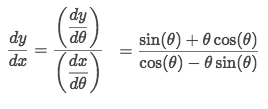
- Plug in the Θ value, to evaluate the slope:
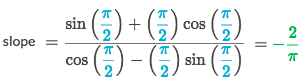
- Find the `x & y` value according to the Θ:
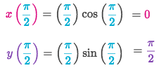
- Now we got everything to form the equation for the tangent line:
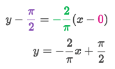
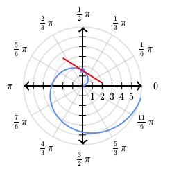

### Example

Solve:
- First, we need to convert the polar function to `x(θ) & y(θ)`:
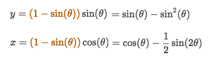
- And we need to find the slope `dy/dx`:
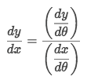
- Since it's a horizontal tangent, so `Slope =0`, which means `dy/dx =0`. But `dx` is dominator can't be zero, so we can set `dy = 0` and solve for θ:
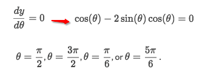
- So the answer is:
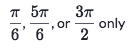

### Example
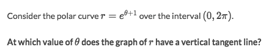
Solve:
- To find a vertical tangent, we have to set the dominator of the slope as 0, that's the only thing makes it **undefined**.
- The slope is `dy/dx`, so we set `dx = 0`.
- The equation for `x` is:
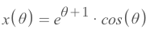
....

