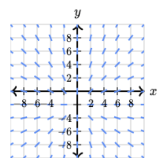
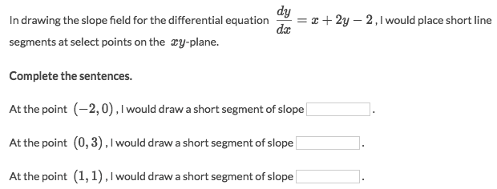
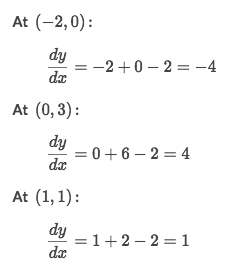
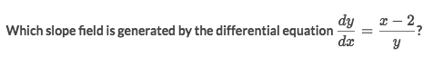
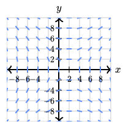
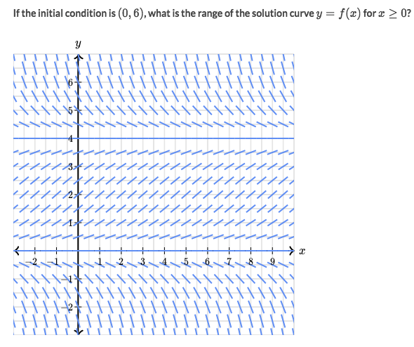
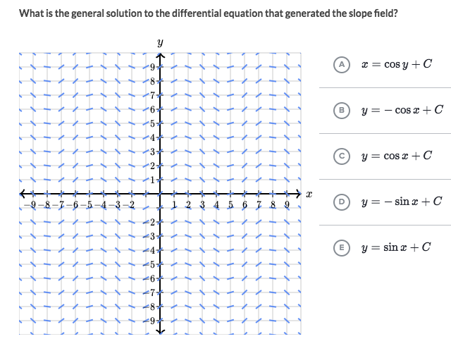

# Slope Field

[▶ Refer to Khan academy: Worked example: range of solution curve from slope field](https://www.khanacademy.org/math/ap-calculus-ab/ab-differential-equations-new/ab-7-4/v/range-of-solution-curve-from-slope-field)

### Example

Solve:

### Example

Solve:
Hint: Try a point or points in each quadrant, like Q1: (2,2), Q2: (-2,2), Q3: (-2,-2), Q4: (2,-2)
- Let's only try the point `(2, 2)`, we will get `y' = 0`, which means the line in Q1 would be horizontal.

### Example

Solve:
- Since `6` is the initial condition, so we make `6` as a boundary.
- The slope at `(0,6)` is a negative slope, which seems keeps negative until `4`.
- So the Range would be `(4, 6]`.

### Example

Solve:
- Try out a point, etc, the initial point is `(0, 1)`.
- **TAKE DERIVATIVE** of each equation, to get the **SLOPE** of each.
- Plug in the `x=0` value to get each slope, and eyeball it.
