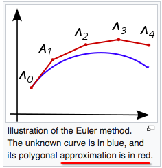
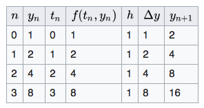
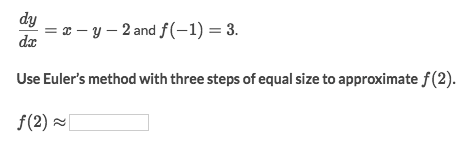
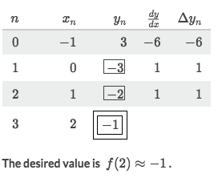

# Euler's Method

Euler's method means an approximation by writing down every critical value in a **table**, and **iterate** many many times until it get closer to the target value.

[Refer to Wiki: Euler method](https://en.wikipedia.org/wiki/Euler_method)

Approximation:

Iterate table:

### Example

Solve:
- It need quite a few ticks. But let's see the result first:

- The table above is the Euler's Method of approximation.
- As the `Euler's Method`, we need to figure out how to get each **column** value, and iterate every row.
- Let's see the Initial row (R₀):
    - We have the `Initial Condition`, so for the **initial row**, We know the `x=-1, y=3`
    - And for iteration, we really need to know how much will the `x & y` change, and they change differently.
    - We've given that `x` is from -1 to 2 in 3 steps, so `Δx = (2 - -1)/3 = 1`
    - Most tricky part is how to get `Δy`. We know `dy/dx ≃ Δy/Δx`, so `Δy ≃ dy/dx · Δx`.
    - Under the initial condition, `dy/dx = (-1) - (3) - 2 = -6`
    - So for this iteration, `Δy = dy/dx · Δx = -6 × 1 = -6`
- Now we get everything for first round (iteratioin):
    - We let `x = -1 +(1) = 0` and `y = 3 +(-6) = -3`
    - For this round, `dy/dx = x - y - 2 = 0 - (-3) -2 = 1`
    - So in this round, `Δy = dy/dx · Δx = 1 × 1 = 1`
- And let's get into the second round..
- Third round...
