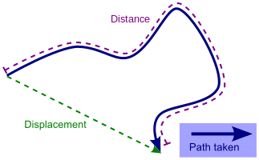
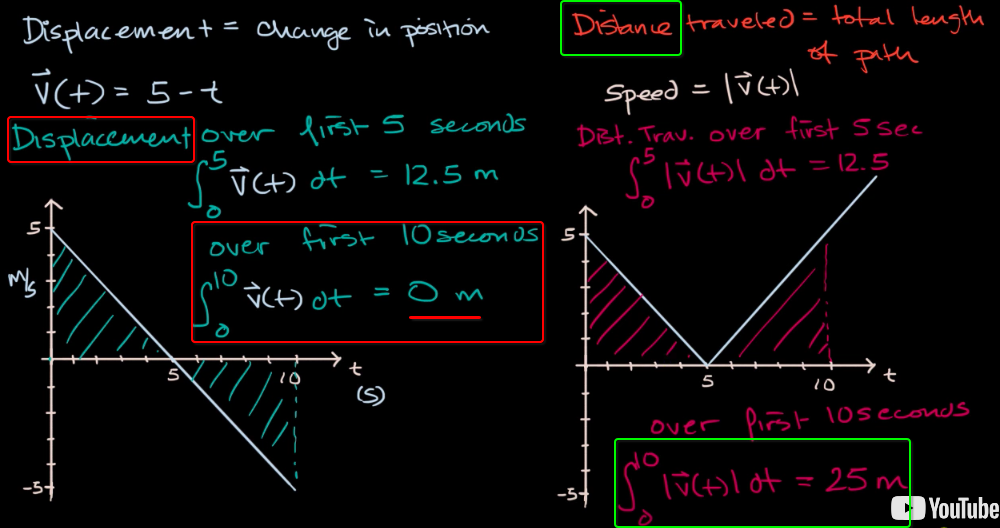
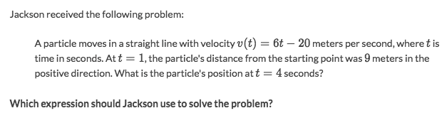
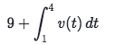
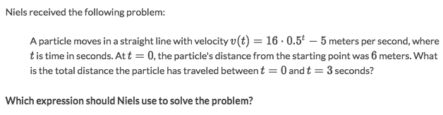
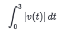
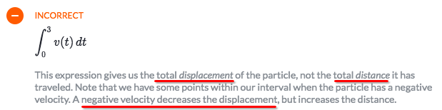
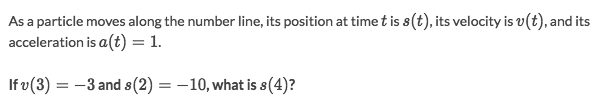

# Motion problems (Integral calc)

[►Jump to Khan academy for some practice: Motion problems (with integrals)](https://www.khanacademy.org/math/ap-calculus-bc/bc-applications-definite-integrals/modal/e/particle-motion)

### 「Displacement」 vs. 「Distance」

`Displacement` literally means "the change in position", but actually it means the **SHORTCUT** of two points, the shortest distance between two points.

[▶Jump over to previous note in Linear Algebra: Displacement is a vector, distance is a scalar.](https://github.com/solomonxie/solomonxie.github.io/issues/48#issuecomment-383118285)

Even if you've been travelling all the time without stops, 
but your `DISPLACEMENT` still can be 0:

### Example

Solve:

### Example

Solve:
- Correct answer:

- Incorrect answer:

### Example

Solve:
- First to know the relationships between `s(t), v(t) and a(t)`:
    - `v(t) = s'(t)` or `s(t) = ʃ v(t) dt`
    - `a(t) = v'(t)` or `v(t) = ʃ a(t) dt`
- Since `a(t) = 1`, so `v(t) = ʃ a(t) dt = ʃ 1 dt = t + C`.
- Substitute: `v(3) = -3 = t + C = 3+C`, so `C=-6` which makes `v(t) = t - 6`
- `s(t) = ʃ v(t) dt = ʃ (t-6) dt = 0.5t² - 6t + C`
- Substitute: `s(2) = 0.5*2² - 6*2 + C = -10`, so `C=0`, which makes `s(t) = 0.5t² - 6t`
- Substitute: `s(4) = 0.5 * 4² - 6*4 = -16`
