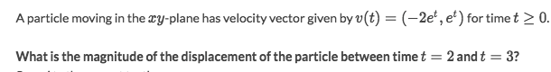
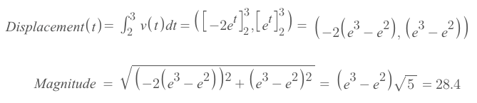

# Planar motion (Integral Calc)

[►Jump to Khan academy for some practice: Planar motion (with integrals)](https://www.khanacademy.org/math/ap-calculus-bc/bc-applications-definite-integrals/modal/e/planar-motion-integral-calc)

### Example

Solve:
- The displacement is calculated as below:

