#  ❖ Function Area between curve & axes

[►Jump to Khan academy for some practice: Curve areas](https://www.khanacademy.org/math/ap-calculus-bc/bc-applications-definite-integrals/modal/quiz/bc-horizontal-area-quiz)

## Area Between 「X-axis」 & 「Curve」

Strategy:
- Figure out the interval (boundaries) for the definite integral.
- Directly Integrate the function: `ʃ f(x) dx` over the interval.

### Example
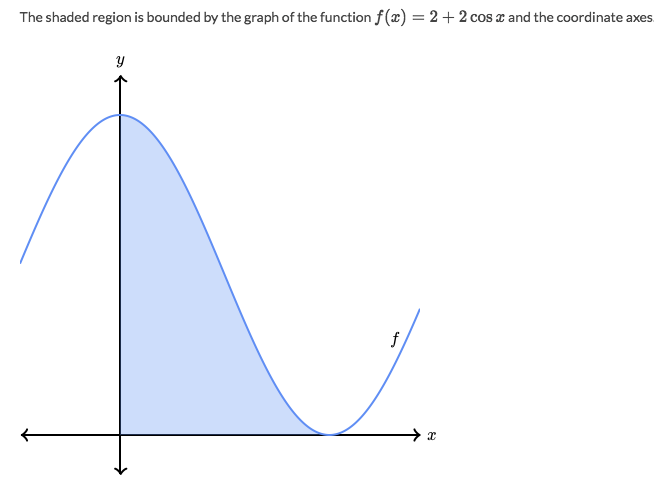
Solve:
- The interval is between `0 & x when f(x)=0`.
- Set `f(x) = 0 = 2 + 2cos(x)` -> `cos(x)=-1` -> `x = arccos(-1) = π`
- So the interval is `[0, π]`.
- The area then is `ʃ (2+2cosx) dx` over the interval `[0, π]`
- The result is `2π` from the definite integral .

## Area Between 「Y-axis」 & 「Curve」

Strategy:
- Inverse the function to make it in term of `y`.
- Instead of integrate in term of `x`, we need to integrate in term of `y`.
- Integrate: `ʃ f(y) dy`

### Example
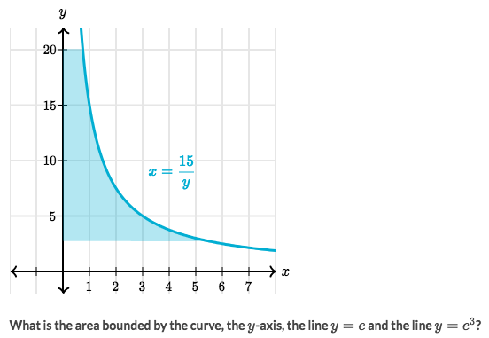
Solve:
- Now we have the function `f(y) = 15/y`
- Integrate the function in term of `y`:
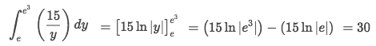

### Example
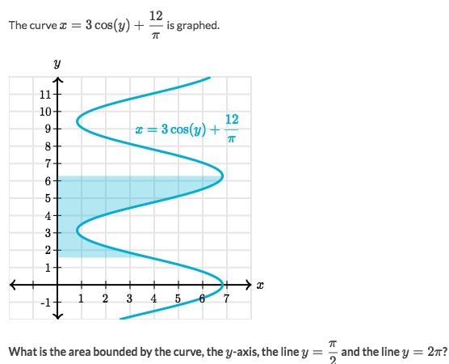
Solve:
- Integral the function in term of `y`:
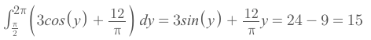

## Area Between 「Two curves」
 

 
Strategy:
 
- Subtract smaller area from bigger area (must be positive): `ʃ |f(x)-g(x)| dx`
 

 

 
### Example
 
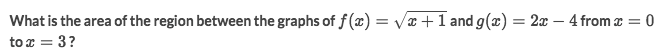
 
Solve:
 
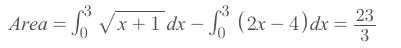
 

 

 
### Example
 
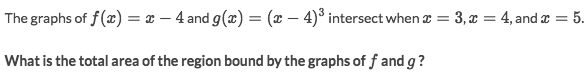
 
Solve:
 
- The graph is as below:
 
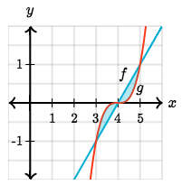
 
- We can actually ignore the graph to calculate:
 
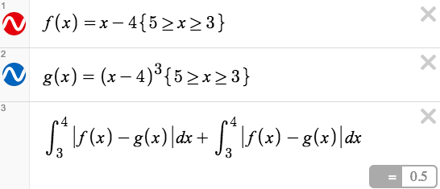
 

## 「Horizontal areas」 between curves

### Example
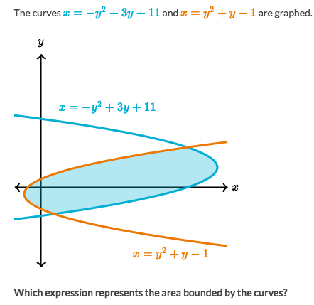
Solve:
- Clearly, it's bit harder to find the x-axis boundaries for the area.
- And the y-axis boundaries could be easily found where as the point two curves intersect.
- So let two equations equal to get two intersect points:
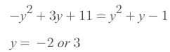
- And since it's area between two functions, we subtract one from another `f(y) - g(y)` to get:
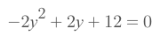
- So the result would be:
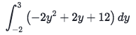

