# Arc Length (Integral Calc)

[►Jump to Khan academy for some practice: Arc Length.](https://www.khanacademy.org/math/ap-calculus-bc/bc-applications-definite-integrals/modal/e/arc-length-of-functions-in-one-variable)
[▼Refer to Khan academy: Arc length intro](https://www.khanacademy.org/math/ap-calculus-bc/bc-applications-definite-integrals/bc-arc-length/v/arc-length-formula)

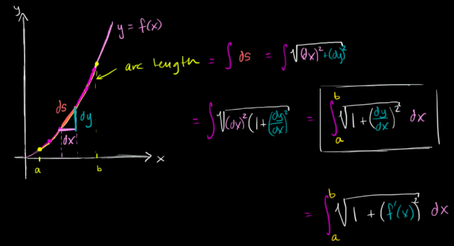
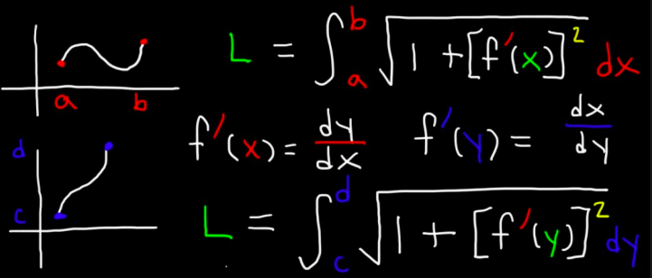

## Formula
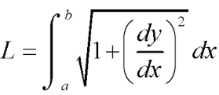

### Example
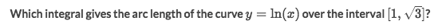
Solve:
- `f'(x) = 1/x`
- According to the formula:
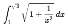

## 「Arc length」 of polar curves

[Refer to Khan academy: Arc length of polar curves](https://www.khanacademy.org/math/integral-calculus/ic-adv-funcs/dc-polar-arc-length/v/polar-arc-length-formula)

[`▶ Practice at Khan academy: Arc length of polar curves`](https://www.khanacademy.org/math/integral-calculus/ic-adv-funcs/dc-polar-arc-length/e/arc-length-of-polar-curves)

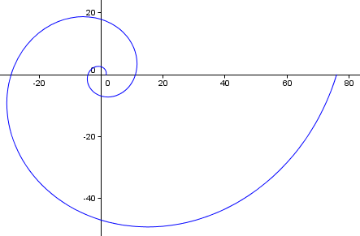

Formula:

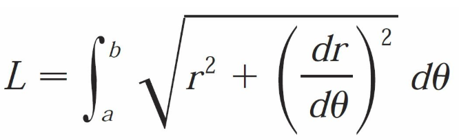

### Example of finding out the right boundaries
Find out the boundaries for each shape:
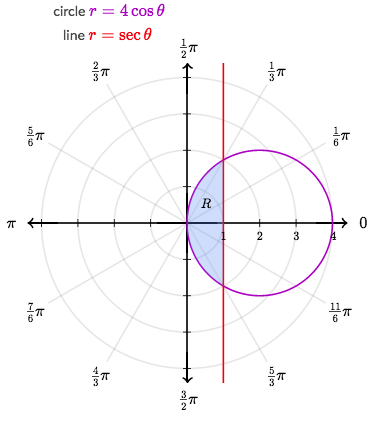
Solve:
- Compute the intersections:
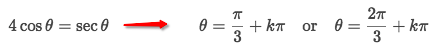
- So thinking of how we draw the arc: starts from `π/3`, through origin (0), ??
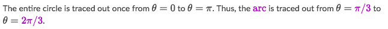
- The chord (straight line) starts at `-π/3` and ends at `π/3`.

### Example
Find out the right boundaries for θ for the red arc length:
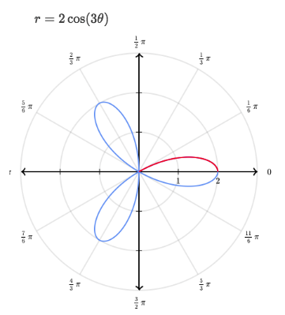
Solve:
- The red arc is in Q1, which `r` starts from 0 and ends at 2.
- We know that when `r=2` the `θ=0`.
- And for `r=0`, there're many solutions, we need to consider which solution to use.
- We set `r=0` and get:
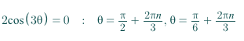
- From the graph we could see it clearly, the red arc starts at `θ=π/6`
- So the boundaries are `0, π/6`

### Example
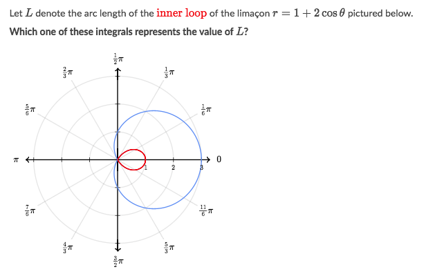
Solve:
- First, we need to find the bounds for the integral. 
- Since each loop of the curve starts and ends at the pole (the origin), we can set `r=0` and solve for `θ`:
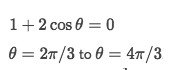
- Now apply the arc length formula on the interval:
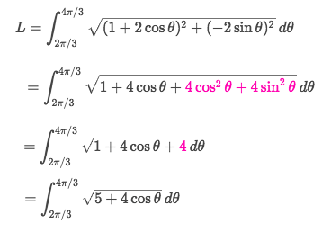

