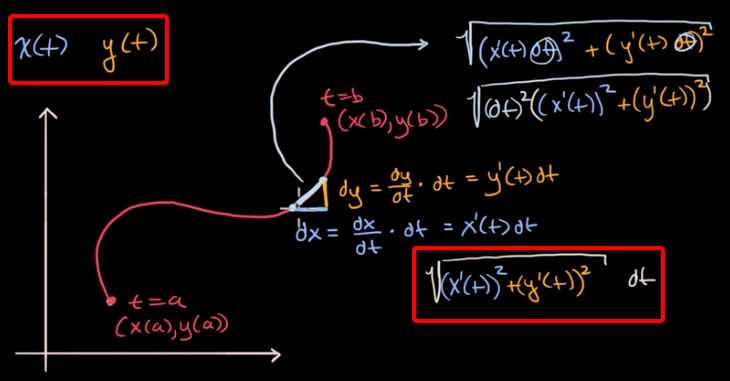
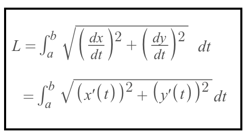
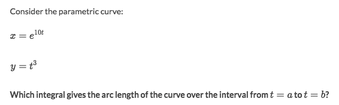

# Parametric Curve Arc Length

`Parametric Curves` are from `Parametric Equations`, means both `x` and `y` are functions, in terms of t: `x(t)` and `y(t)`.

[`►Jump to Khan academy for some practice: Arc Length.`](https://www.khanacademy.org/math/ap-calculus-bc/bc-applications-definite-integrals/modal/e/arc-length-of-functions-in-one-variable)

[Refer to xaktly: Parametric Equations](http://xaktly.com/ParametricEquations.html)
[▼Refer to Khan academy: Parametric curve arc length](https://www.khanacademy.org/math/ap-calculus-bc/bc-applications-definite-integrals/bc-arc-length/v/parametric-curve-arc-length)

## Formula

### Example

Solve:
- Just to apply the formula.

