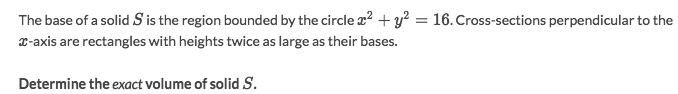
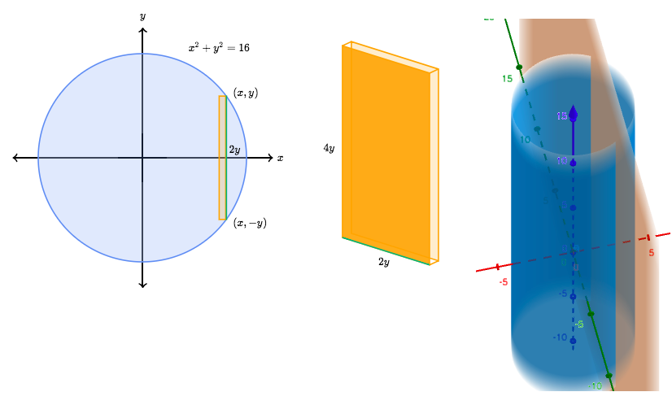
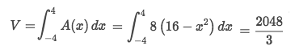
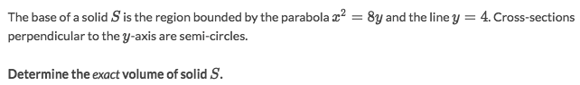
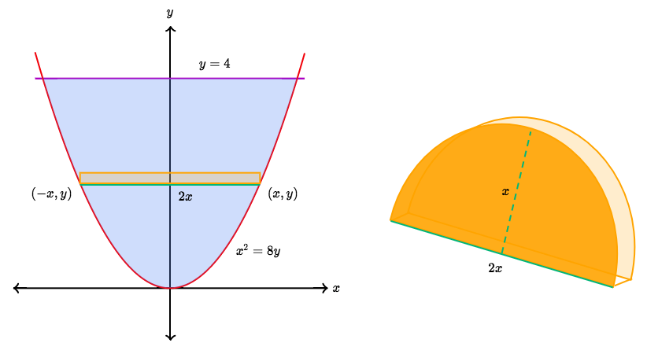
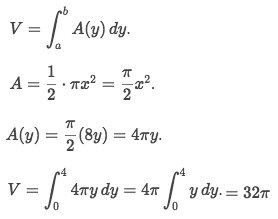
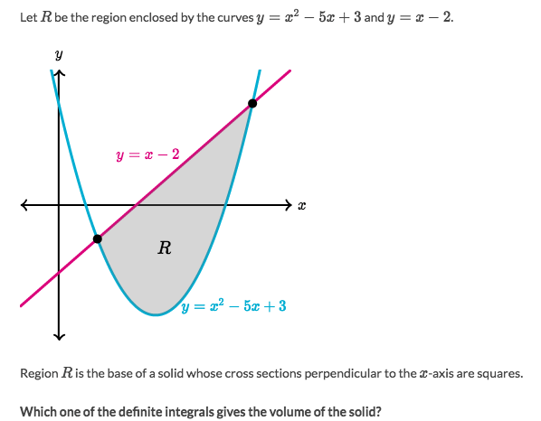
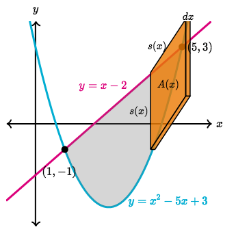
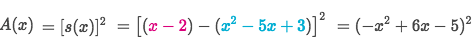
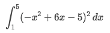

#  ❖ Volumes of 「3D Solids」 (Integral Calc)

Strategy:
- Notice this is a complete graphical problem, so:
**YOU HAVE TO USE TOOLS TO BUILD GRAPHICS BEFORE SOLVING PROBLEM!!!**
- Using these graphic calculators:
    - [▶Desmos](https://www.desmos.com/calculator), for instantly building function graphs on XY-axes
    - [▶Geogebra-3D](https://www.geogebra.org/3d?lang=en), for building 3D graphs
    - [▶Symbolab](https://www.symbolab.com), for solving hairy equations
- Simplify the problem to variables and equations.
- That's all.

Anyways, the key to solve these problems, is to **HAVE STRONG SENSE OF 3D SHAPES.**
So that you could sense what is this problem asking for. And once you know what it's saying, you could easily solve it.

## Volumes of solids of 「known shapes cross-section」

[►Jump to Khan academy for some practice: Volumes of solids of known cross-section](https://www.khanacademy.org/math/ap-calculus-bc/bc-applications-definite-integrals/modal/e/volumes-of-solids-of-known-cross-section)

### Example

Solve:
- First, we really really need to graph this out before anything else:

- So imagine we're slicing the `cylinder` from top to bottom in infinite many discs (of course it's rectangle). So the mission is to find out the rectangle's area, and integrate them.
- Let's figure out the boundaries first:
    - Since the base is a circle, and it's a fixed certain circle. 
    - So the boundaries(interval) would be at intersections of the circle and x-axis, aka. `y=0`
    - Set `y=0` and solve the equation to get `x = -4 and 4`, so the interval is `[-4, 4]`.
- Let's then see what is the rectangle slice's area:
    - Since the circle centred at origin, and the slice is perpendicular to X-axis,
    - So the `width` of rectangle is always `2y`.
    - And we're told the height of the rectangle is doubled than base, so `height = 4y`
    - (Btw, the `depth` of the box is infinitely thin as `dx`.)
    - So the area of the standing rectangle is: `A(x) = 2y · 4y = 8y² = 8(16 - x²)`
- Let's integrate those rectangles over the interval `[-4, 4]`:

### Example

Solve:
- First need to graph it as below (you can get help with Desmos or GeoGebra):

- Then we know the radius of the semi circle is `x`, so:

## Volumes of 「unknown solids」

### Example

Solve:
- Each slice will be like this:

- The area of the slice would be:

- The boundaries are at two curves' intersection, which are `x = 1 and 5`
- So integrate all the slices:

