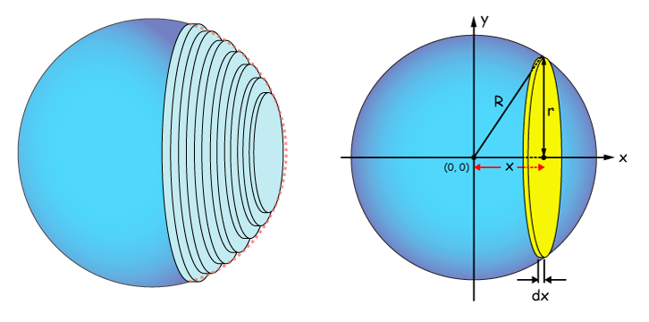
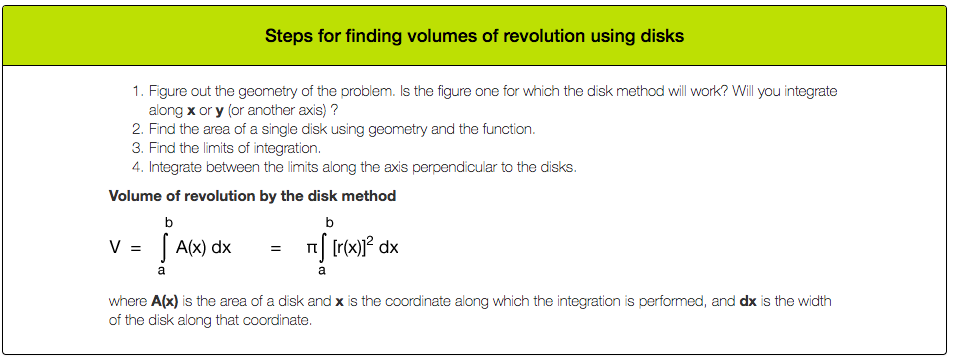
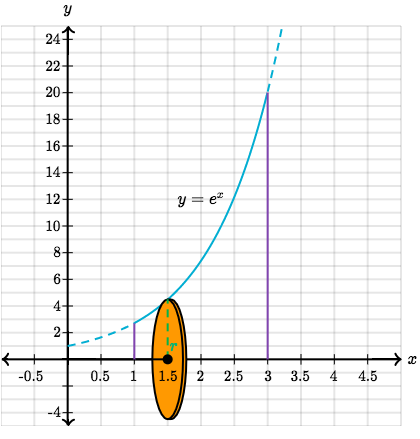
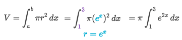
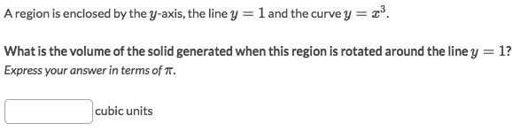
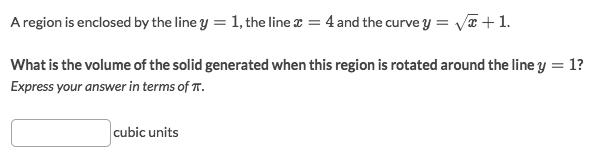
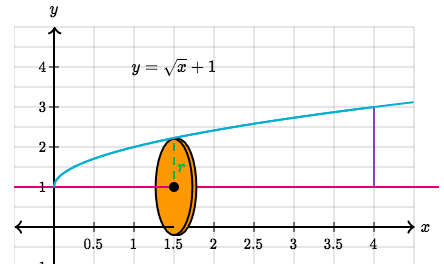

#  ❖ Disc Method

`Disc Method` is a method for calculating the **`Volume of a 3D shape by rotating a 2D shape`**.

The strategy of this method is:
- First to **ROTATE** an infinitely small piece of the whole graph
- Calculate the **AREA** of this `Rotated Circle`, or so called `disc`.
- Integrate all the discs.

[►Jump to Khan academy for some practice: Disc Method](https://www.khanacademy.org/math/ap-calculus-bc/bc-applications-definite-integrals/modal/e/the-disk-method)
[▼Refer to the article: Finding volumes of 3-D objects with circular symmetry in at least one dimension](http://xaktly.com/VolumesDisk.html)

### Example

Solve:
- First need to completely understand the question and visualize it using `Disc Method`:

- Calculate the **area of disc** and integrate them:

### Example

Solve:
- The radius of the disc is exactly equal to `y` value, means `r = y = eˣ`
- The area of the disc then be `Area(x) = πr² = π · e²ˣ`
- Since We're integrating `Horizontally` along X-axis, so the integral should be `ʃ A(x) dx`
- Integral all the discs: `Volume = ʃ A(x) dx = ʃ π · e²ˣ dx`
- Calculate the integral.

### Example

Solve:
- The 2D shape is like this one:

- So we are to integrate discs along X-axis: `ʃ Area(x) dx`
- The interval is `[0, 4]`.
- It's tricky to get the radius of the disc: `r = y - 1 = √x +1 -1 = √x`
- So the area of each disc is: `Area(x) = πr² = πx`
- Integrate those discs over inteval `[0, 4]`: `Volume = ʃ Area(x) dx = ʃ πx dx = 8π`.
