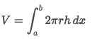
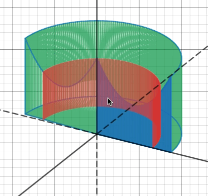
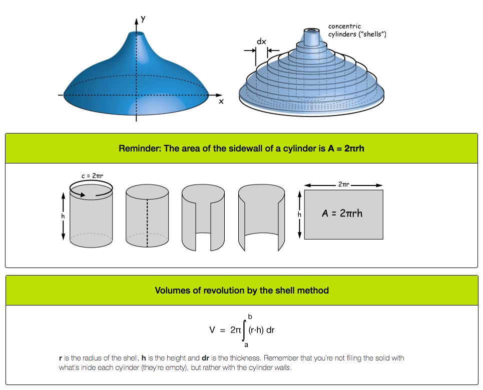
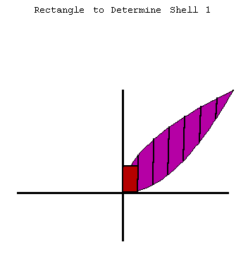
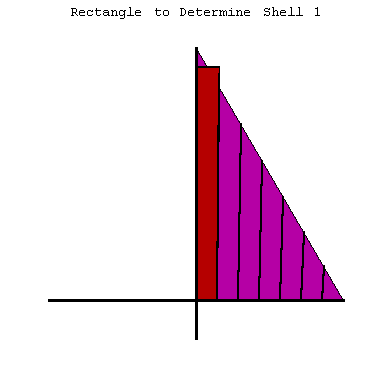
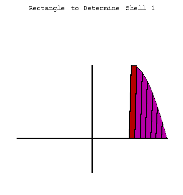
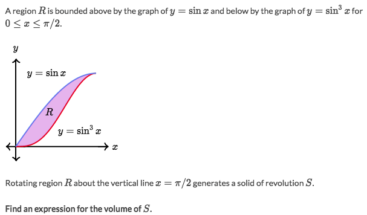
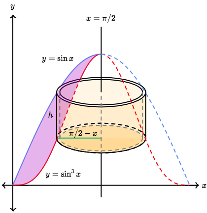
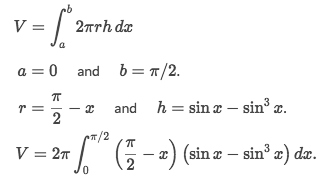

#  ❖ Shell Method

`Shell Method` is particularly good for calculating volume of a 3D shape by **rotating** a 2D shape around a **VERTICAL LINE**.
Imagine there is a **`CYLINDER`**, and we're to calculate the surface area of the cylinder, and integrate the surface areas when the cylinder gets **thiner and thiner**.

[Refer to Khan academy: Shell method for rotating around vertical line](https://www.khanacademy.org/math/ap-calculus-bc/bc-applications-definite-integrals/bc-shell-method/v/shell-method-for-rotating-around-vertical-line)
[►Jump to Khan academy for some practice: Shell method](https://www.khanacademy.org/math/ap-calculus-bc/bc-applications-definite-integrals/modal/e/volumes-of-solids-of-revolution-by-shells)
[▼Refer to Desmos Animation: Solids of Revolution (about y-axis)](https://www.desmos.com/calculator/oiwkngzdl1)

[▼Refer to the awesome article: The shell method of finding volumes of revolution](http://xaktly.com/VolumesShell.html)

[▼Refer to mathdemos.org for more intuitive animations: SHELL METHOD DEMO GALLERY](http://www.mathdemos.org/mathdemos/shellmethod/gallery/gallery.html)

### Example

Solve:
- Let's draw it out first:

- Based on the `Shell method` of integrating `Cylinder's shells`, we got the equation:

