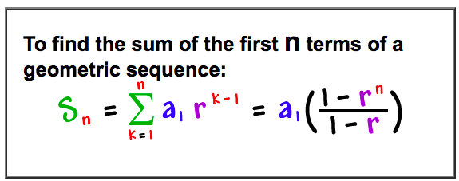
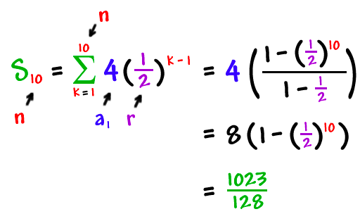
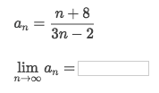
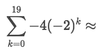
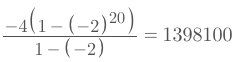
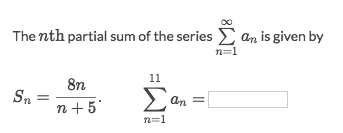
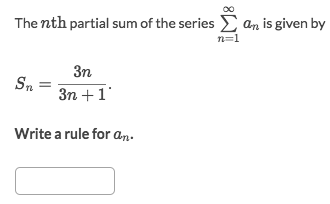
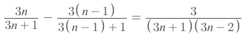

#  ❖ 「Series」 basics (Calculus level)

[►Jump back to previous note: Series (High school level)](https://github.com/solomonxie/solomonxie.github.io/issues/44#issuecomment-375569163)

Explicit Sequence vs. Recursive Sequence:
> Explicit sequence would be presented as: `a𝓃 = a₁ · kⁿ⁻¹`.
Recursive sequence would be presented as: `a₁ = 3, a𝓃 = k · a𝓃₋₁`

Sequence vs. Series:
> Sequence is a **_LIST_** of numbers, 
Series is **_a NUMBER_**: the SUM of a sequence.

Convergence vs. Divergence:
> Convergence means the **limit** of a function **EXISTS**.
Divergence means the limit **DOES NOT EXISTS**.

## 「Geometric Series」 in 𝚺 Notation

[▼Refer to Cool Math: Geometric Series](http://www.coolmath.com/algebra/19-sequences-series/08-geometic-series-02)

### Example

## 「Infinite Sequence」convergence | divergence

[►Jump to practice: Sequence convergence/divergence](https://www.khanacademy.org/math/ap-calculus-bc/bc-series/modal/e/convergence-and-divergence-of-sequences)

### Example

- Easiest way: Apply the `L'hopital's Rule, take both Top's & Bottom's derivatives until both of them become numbers.
- So we get: `1/3`.

## 「Finite Geometric Series」

[►Jump to practice: Finite geometric series](https://www.khanacademy.org/math/ap-calculus-bc/bc-series/modal/e/geometric-series--1)

### Example

Solve:
- By using the `Geometric Series formula`, we get the informations as below:
    - **Common ratio**: `r = -2`
    - **Amount of items**: `n = 20`. Because `k` starts from 0, so there're 20 terms.
    - **Initial term**: `a₀ = -4`
- We calculate and get the result as below:

## 「Partial Sums」

`Partial sums` is just a fancy word for `Finite series`, because it's a a **part** of infinite series.

### Example

Solve:
- The tricky part is **how to count the amount of terms**.
- Since `n` starts from 1, so there're 11 terms, which means we're to calculate `S₁₁`.
- `S₁₁ = 88/16 = 11/2`

### Example

Solve:
- The tricky here is that: `a𝓃 = S𝓃 - S𝓃-1`, because `S𝓃 = a₁ + a₂ + a₃ +.... + a𝓃-1 + a𝓃`.
- So the result is:

