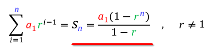
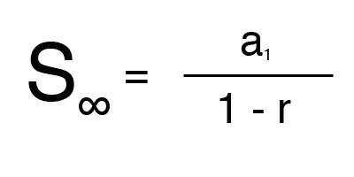
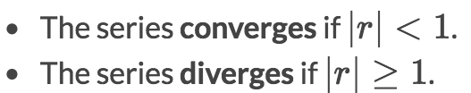
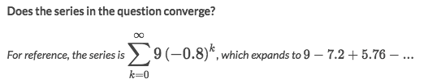
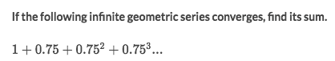
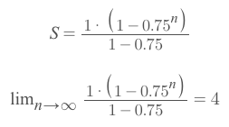

# Infinite Geometric Series

### Common Formula (Finite & Infinite)

### Infintite Formula

## Determine the Infinite Geometric Series Converges or Diverges
There are two basic rules for infinite **geometric** series:

### Example

Solve:
- Yes. Because `|-0.8| < 1`, satisfies the basic converge rules.

## Evaluate Infinite Geometric Series

### Example

Solve:
- First off, we need to find the essential information for the geometric series:
    - Initial term: `a₀ = 1`
    - Common Ratio: `r = 0.75`
- So the Infinite series would be:

