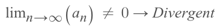
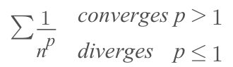
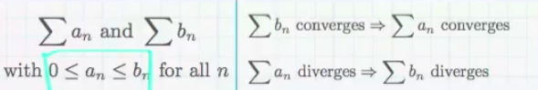
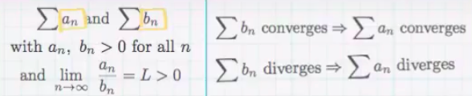
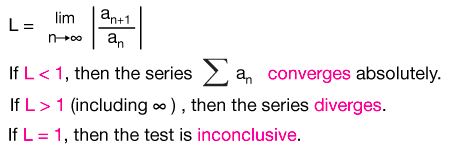
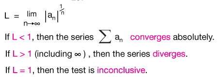
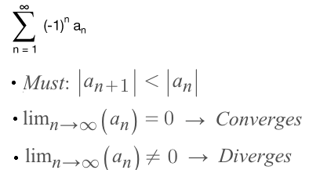
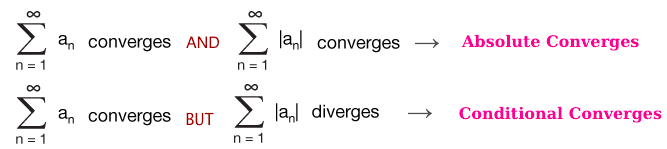

#  ❖ Convergence Tests [DRAFT]

> Here lists common Convergence Tests and overview of each. Details are singled out to each section.

`Convergence test` are a set of tests to determine wether the series **CONVERGENT** or **DIVERGENT**.
It includes:

Test | Description
-- | --
► Divergent Test | Take nth term's limit. (only to test divergence)
► Integral Test | Take limit of the series function's integration.
► p-series Test | Examine at the `p` value of `1/nᴾ`.
► Comparison Test | Compare the series to a "similar" p-series or geometric-series.
► Ratio Test | Take limit of two terms ratio.
► Root Test | Take the limit of nth root of nth term.
► Alternating Test |  Test if terms are decreasing, and take limit of nth term.

## 「Divergent Test」

> **Take the limit of nth term, if it's NOT ZERO, then it's DIVERGENT.**

## 「Integral Test」

## 「p-series Test」

## 「Direct Comparison Test」

> **Compare the series to a "similar" p-series or geometric-series.**

## 「Limit Comparison Test」

> **Compare the series to a "similar" p-series or geometric-series.**

## 「Ratio Test」

> **Take limit of two terms ratio.**

## 「Root Test」

> **Take the limit of nth root of nth term.**

## 「Alternating Series Test」

> **Test if terms are decreasing, and take limit of nth term.**

## 「Absolute Convergence」 & 「Conditional Convergence」

