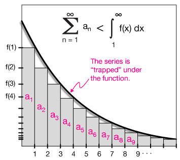
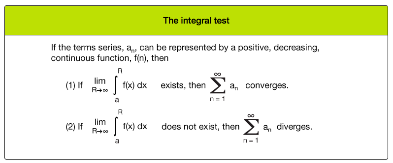
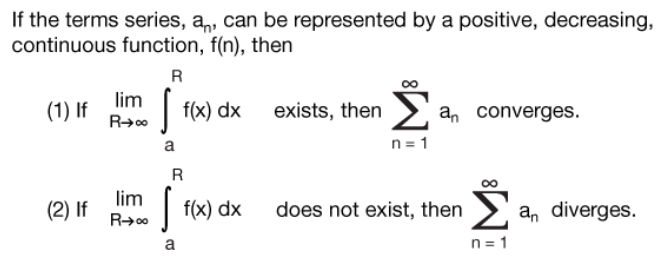
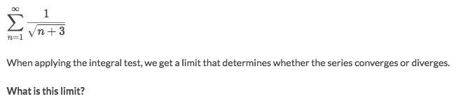
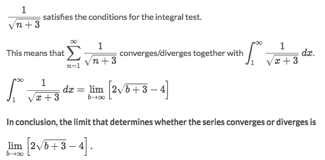
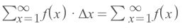
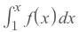
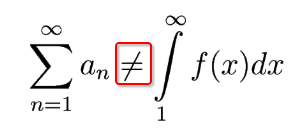

# Integral Test

[`►Jump over to have practice at Khan academy: Integral test.`](https://www.khanacademy.org/math/ap-calculus-bc/bc-series/modal/e/integral-test)
[Refer to article from tkiryl: The Integral Test](http://www.tkiryl.com/Calculus/Section_8.3--The_Integral_and_Comparison_Tests/The_Integral_and_Comparison_Tests.html)
[Refer to Khan academy: Integral Test](https://www.khanacademy.org/math/ap-calculus-bc/bc-series/modal/v/integral-test-intuition)

[▼Refer to awesome article from xaktly: Integral Test](http://xaktly.com/IntegralTest.html)

## 「Conditions」 of Integral test

Assume the series `a𝖓` can be represented as a function `f(x)`.
There are a few limitations for it to use the Integral test:
- `f(x)` MUST BE continuous.
- `f(x) > 0`. It MUST BE a **positive** function.
- `f'(x) < 0`. It's MUST BE **decreasing**.

## 「Using」 Integral test

### Example

Solve:

## 「Understanding」 Integral test

The `Integral test` has introduced the idea of calculating the total area under the function:
- The series has step of 1, which means `Δx = 1`
- We can sum the areas (which equals the series itself): 

- But when we are to **INTEGRATE** the function area under the function:

- The `dx` is infinitely small rather than a fixed number `Δx = 1`.
- As result, the **INTEGRAL** is almost always greater than the **SERIES AREAS**.

As been said above, we got this conclusion:

> **Notice: DO NOT use the `Integral Test` to EVALUATE series, because in general they are NOT equal.** 

