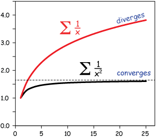

# p-series Test

For the the series in form of `1/nᴾ`, 
the easiest way to determine its convergence is using the `p-series` test:

[▼Refer to xaktly: p-series test/harmonic series](http://www.xaktly.com/pSeries.html)

## 「Harmonic Series」

> Harmonic Series is `∑ 1/n`, and Harmonic Series **DIVERGES**. That's all you need to know.

[▼Refer to Khan academy: harmonic series diverges](https://www.khanacademy.org/math/ap-calculus-bc/bc-series/modal/v/harmonic-series-divergent)

