#  ❖ Comparison Test

> You can understand `Comparison Test` intuitively as a `Sandwich Test`.

**THIS TEST IS GOOD FOR `RATIONAL EXPRESSIONS`.**

## 「Direct Comparison Test」

Assume that we have a series `a_n`, and we're to make up a similar series to it as `b_n`:

The logic is:
- If `b > a` & `b` **converges**, then `a` **converges** as well.
- If `a > b` & `b` **diverges**, then `a` **diverges** as well.

It's so much easier if you think it graphically.

[▼Refer to video: Comparison Test (KristaKingMath)](https://www.youtube.com/watch?v=ctJGrBzGoss&index=22&list=PLJ8OrXpbC-BPaXEPecIAS_ddViV2_gcYL&t=0s)
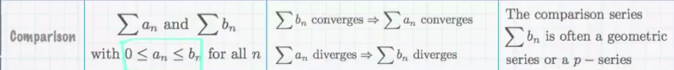
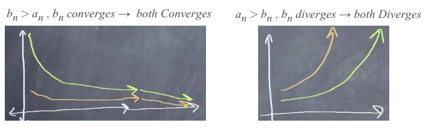

[▼Refer to xaktly: Comparison Test](http://www.xaktly.com/ComparisonTest.html)
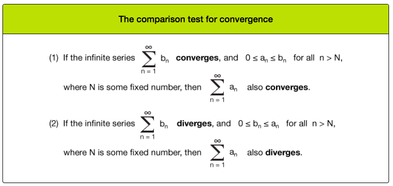

### Example
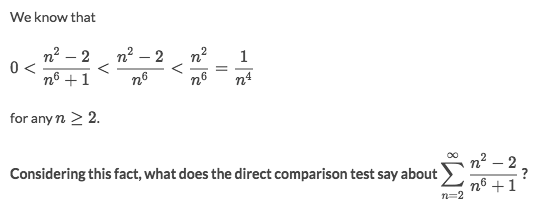
Solve:
- Assume the asked series as `a_n`, and we make up a very similar series bigger than it, as `b_n`:
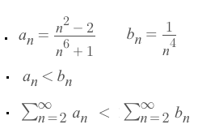
- Apply the `p-series test` we get that the `b_n` **converges**.
- Since `a_n < b_n`, so according to the `Sandwich test (Direct comparison test)`, `a_n` **converges** as well.

## 「Limit Comparison Test」

`Limit comparison test` is like an extension when the `Direct comparison test` **won't** work. 
etc., when we compare `a` with `b`, although `b` converges but `a > b`, so we can't make any conclusion.
And that's where the `limit comparison test` comes in place.

The logic is:
- Take the limit of the division `a/b`.
- If the `Limit > 0`, then they **both converges** or **both diverges**.
- If the `Limit ≤ 0`, then there's no conclusion.

[►`Jump over to Khan academy for practice: Limit comparison test`](https://www.khanacademy.org/math/ap-calculus-bc/bc-series/modal/e/limit-comparison-test)

[▼Refer to video: Limit Comparison Test (KristaKingMath)](https://www.youtube.com/watch?v=PPTLtFhAp6c&list=PLJ8OrXpbC-BPaXEPecIAS_ddViV2_gcYL&index=22)
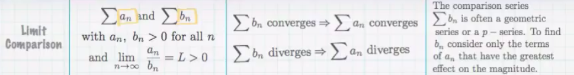

[▼Refer to xaktly: Limit Comparison Test](http://www.xaktly.com/LimitComparisonTest.html)
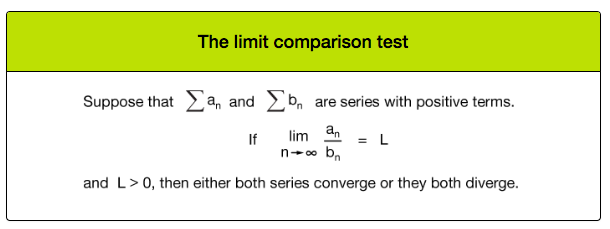

### Example
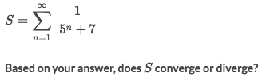
Solve:
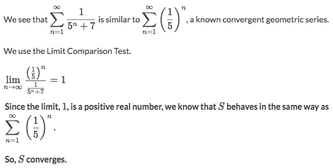

### Example
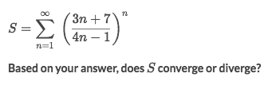
Solve:
- We can't easily tell in the comparison who's greater, so we decide to apply the `limit comparison test`:
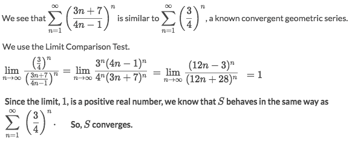

