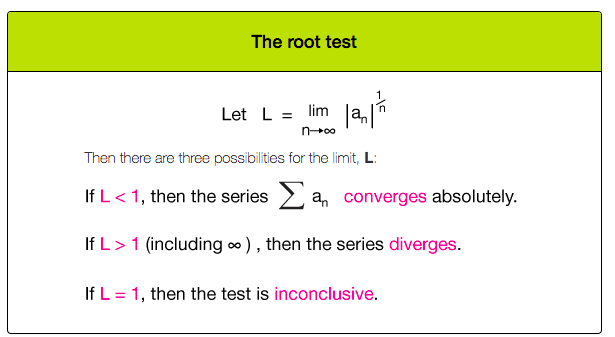
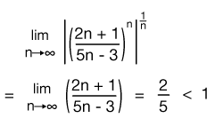

# Root Test

"The root test is used in situations where a series term or part of it is **raised to the power of the index variable**. "

> Notice: The root test **isn't** a good choice if a series contains **factorial** terms.
If the root test isn't fairly easy to use, you probably **shouldn't** use it. 
But when it works, it often cuts to convergence or divergence quickly.

[▼Refer to xaktly: Ratio test / root test](http://www.xaktly.com/RatioTestRootTest.html)

### Example

Solve:
- Apply the `root test`:

- Since `L < 1`, so it converges.
