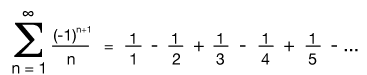
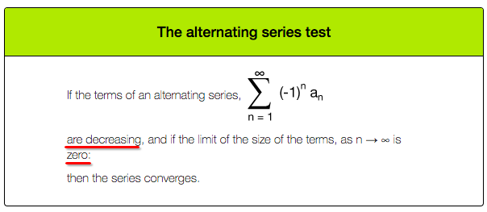
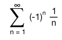
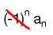
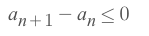
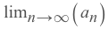

#  ❖ Alternating Series Test

It's the test for `Alternating series`.

[►Refer to Khan academy: Alternating series test](https://www.khanacademy.org/math/ap-calculus-bc/bc-series/modal/v/alternating-series-test)
[►Refer to xaktly: Alternating Series](http://www.xaktly.com/AlternatingSeries.html)

## Alternating Series

It means,
**Terms of the series "alternate"  between positive and negative.**

etc., `The alternating harmonic series`:

## The Alternating Series Test

The very good example of this test is the `Alternating Harmonic Series`:

▲ It does **CONVERGES**. (But the Harmonic Series does NOT converge)

Strategy:
- Take AWAY the `Alternating sign (-1)ⁿ`:

- Determine if the rest part is a decreasing series:

- Take limit of the rest part:

- If `Limit = 0`, then the series **CONVERGES**.
- If `Limit ≠ 0`, then the series **DIVERGES**.

### Example

Solve:
- Notice this is an `alternating series`, so we're to apply the `alternating series test`.
- Take away the `alternating term`, and left with `(2/p)ⁿ`.
- So the series only converges if `(2/p)ⁿ` is **decreasing** and its **limit is `0`**.
- And the only way to make it decreasing is to make sure `(2/p) < 1`.
- Based on that `p` value, the limit of `(2/p)ⁿ` is surely a `0`.
- Therefore, `p > 2` makes the series converges.

### Example

Solve:
- Notice this is an `alternating series`, so we're to apply the `alternating series test`.
- Take away the `alternating term`, and left with `(2n)ᴾ`.
- So the series only converges if `(2n)ᴾ` is **decreasing** and its **limit is `0`**.
- And the only way to make it decreasing is to make sure `p < 0`.
- Based on that `p` value, the limit of `(2n)ᴾ` is surely a `0`.
- Therefore, `p < 0` makes the series converges.

