#  ❖ 「Absolute」 vs. 「Conditional Convergence」

> This section is not about calculation, but rather about the logic.

[▶Refer to Khan academy: Conditional & absolute convergence](https://www.khanacademy.org/math/ap-calculus-bc/bc-series-new/modal/v/conditional-and-absolute-convergence)

[`▶ Back to previous note on: p-series test`](https://github.com/solomonxie/solomonxie.github.io/issues/49#issuecomment-399662321)
[`▶ Practice at Khan academy: determine-absolute-or-conditional-convergence`](https://www.khanacademy.org/math/ap-calculus-bc/bc-series-new/modal/e/determine-absolute-or-conditional-convergence)

▼We can have a series in **`Given form`** and **`Absolute form`**:
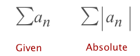

We call the series:
- `Absolute Convergent`: if the series converges in BOTH **Given form** & **Absolute form**.
- `Conditional Convergent`: if the series converges ONLY in **Given form** BUT NOT in **Absolute Form**.

etc., 
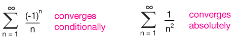

[▼Refer to xaktly](http://www.xaktly.com/AlternatingSeries.html)
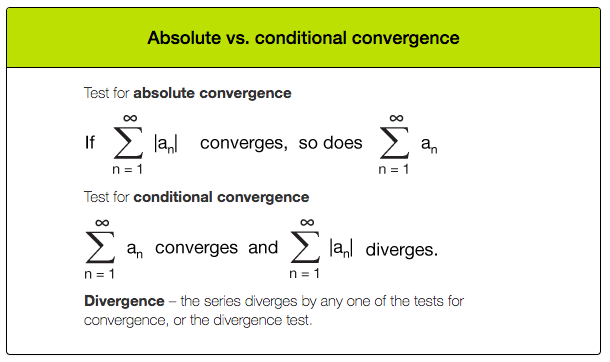

### Example
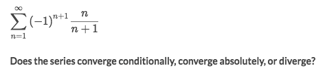
Solve:
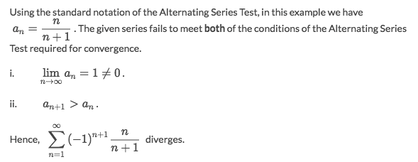

### Example
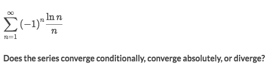
Solve:
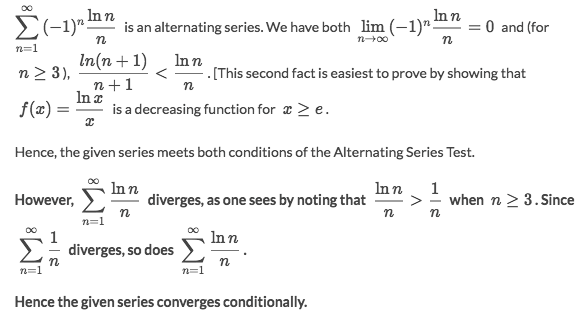

### Example
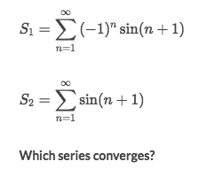
Solve:
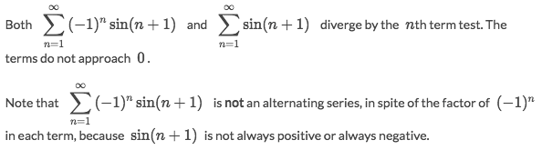

### Example
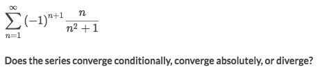
Solve:
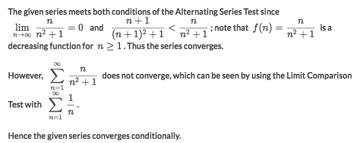

