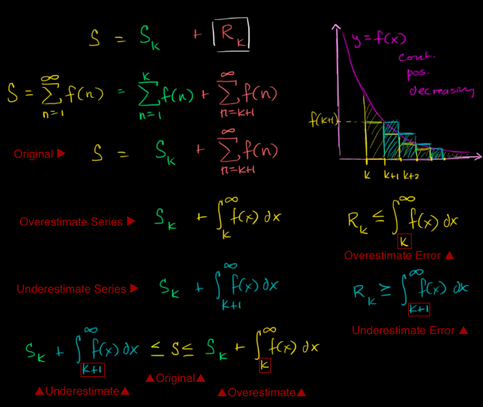

#  ❖ Error Estimation Theorem

The Error Estimation Theorem is not only for alternating series, but available for all infinite series.

[▼Boundary of estimating series: refer to Khan academy: Series estimation with integrals](https://www.khanacademy.org/math/ap-calculus-bc/bc-series/bc-estimating-inf-series/v/integrals-estimating-p-series)

