#  ❖ Power Series

> Try to think `Power series = Geometric Series`.

[►Refer to Math24: Power series](https://www.math24.net/power-series/)

`Power series` is actually the `Geometric series` in a more general and abstract form.

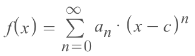

For easier to remember it, that could be simplified as:

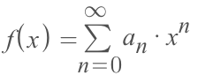

In this function it's critical to know that:
**`a_n` IS A CONSTANT NUMBER! NOT A VARIABLE !**

## Differentiate 「Power series」

[►Refer to Khan academy: Differentiating power series](https://www.khanacademy.org/math/ap-calculus-bc/bc-series/modal/v/differentiating-power-series)

We have 2 ways to differentiate series, they work same way:
- One way is to expand the series with real numbers (1,2,3...) and take their derivatives:
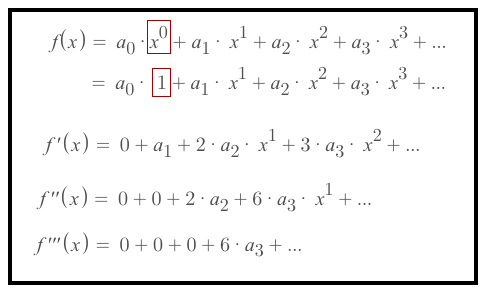
(▲Note that this is constantly true for power series.)
- Another way is to calculate the term's derivative and then plug in the real numbers (1,2,3):
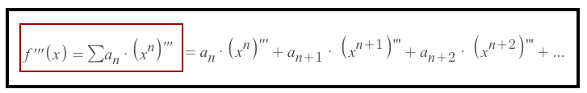

Either way will do, it depends on the actual equation for you to choose which way you're gonna use.

### Example
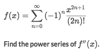
Solve:
- Let's organize this function to make it clear:
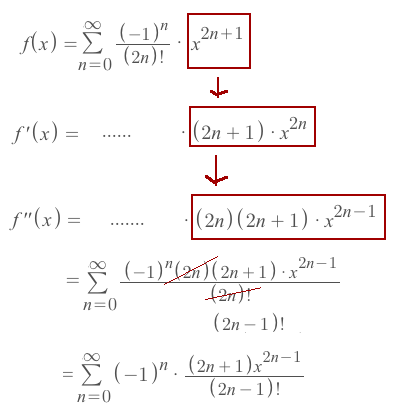

### Example
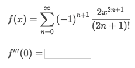
Solve:
- Notice that: If we plug in the `x=0` at beginning, everything will be `0` and we don't have anything to calculate.
- So Let's keep the `x` in the terms until the **last step**.
- It's easier to `expand the series with real numbers`, and we're to try 3 or 4 terms in this case. 
- Because at the end of it you'll notice, if we're doing `Third Derivative`, then more than 3 terms will just bring more `0`s.
- First we're to organize the function in the standard **power series** form:
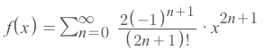
- And the **constant number `a_n`** in the function is:
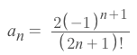
- Let's plug in the real number (0,1,2,3,4) for `n` to expand the series:
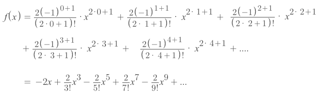
- Based on that we can take the derivatives:
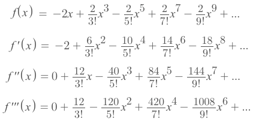
- Now we've got the `third derivative`, so let's plug in the `x=0` and see what we get:
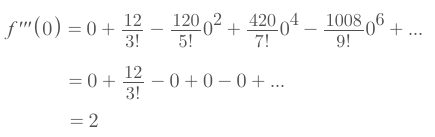
- And that's the answer.
- And now you know **why in this case it's a waste to calculate more terms.**

## Integrate 「Power Series」

### Example
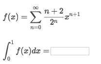
Solve:
- Knowing that `Integrate a series` can be turned to `a series of Integrations of terms`:
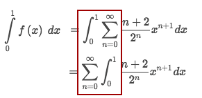
- Integrate the terms:
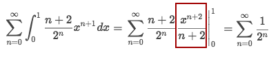
- And we get a simple `Geometric series`. So that we can apply the formula of calculating geometric series:
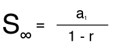
- Let's apply the formula:
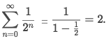

## 「Integrals & derivatives」 of functions with 「known power series」

[`► Jump over to have practice at Khan academy.`](https://www.khanacademy.org/math/ap-calculus-bc/bc-series-new/modal/e/creating-power-series-from-geometric-series-using-differentiation-and-integration)

### Example
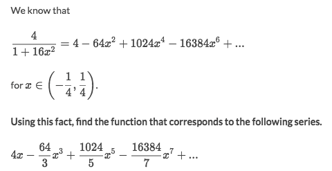
Solve:
- Let's assume the function of the **series above** is `f(x)`, and the **series below** is `g(x)`
- It's clear to see that the `g(x) is the `Antiderivative` of the `f(x)`.
- So we just need to **integrate** the function of the `f(x)`:
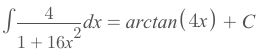
- We see that the `antiderivative` can represent the `g(x)`, but only with the `C` in it:
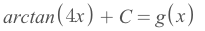
- So we need to solve for `C`. The easiest way is to plug in `0` for `g(x)`:
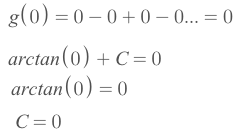
- Then the answer is:
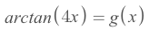

### Example
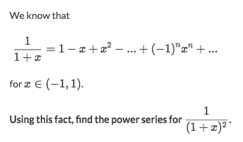
Solve:
- Set the two series as `f(x)` and `g(x)`.
- It's clear that `g(x) = -f'(x)`.
- So by differentiate `f(x)` we will get:
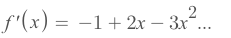
- Then `-f'(x)` would be:
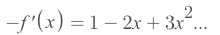

