#  ❖ Taylor Series

`Taylor series`, or `Taylor polynomial` is a series that can **REPRESENT** a function,
**regardless** what function it is.

[▼Refer to 3Blue1Brown for animation & intuition: Taylor series | Chapter 10, Essence of calculus](https://www.youtube.com/watch?v=3d6DsjIBzJ4&t=56s)
> "Taylor Series is one of the most powerful tools Math has to offer for **approximating functions.**" - 3Blue1Brown

[►Refer to Khan academy: Taylor & Maclaurin polynomials intro (part 1)](https://www.khanacademy.org/math/old-ap-calculus-bc/bc-series/bc-taylor-series/v/maclaurin-and-taylor-series-intuition)
[▼Refer to xaktly: Taylor Series](http://www.xaktly.com/TaylorSeries.html)
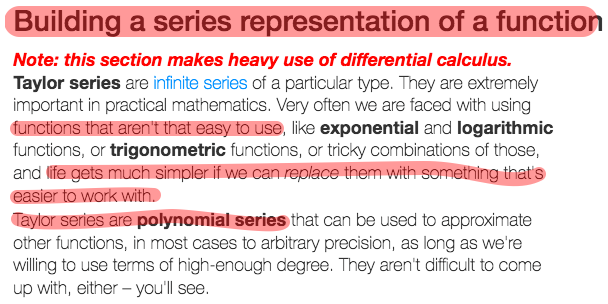

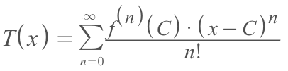
(▲ `C` represents the **centre** where we're centred at to approximate the function.)

> ▲ Notice: The **`Taylor Series`** is a **`Power Series`**, which means we can use a lot of techniques of power series on this to operate it easily.

We could expand it and make it clearer ▼:
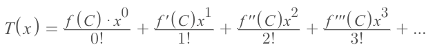

The **main purpose** of using a `Taylor Polynomial` is to **REPLACE** the original function with a **polynomial**, which it is **easy to work with**.

etc., we can express the function `f(x) = eˣ` as ▼:
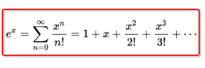

**More importantly**, by **adding more & more terms** into the polynomial, we can approximate the function more precisely:

[►Refer to joseferrer: Mathematical explanation - Taylor series](https://steemit.com/mathematics/@joseferrer/mathematical-explanation-taylor-series)
[►For More animation, visit Desmos: Taylor Series Visualization](https://www.desmos.com/calculator/oiexhzavjp)

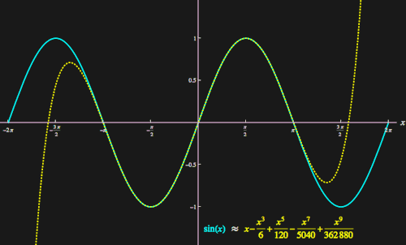

### Example
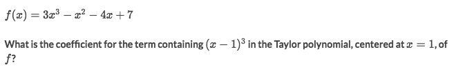
Solve:
- First to know the formula of `Taylor Series` centred at `x=1`:
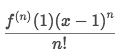
- The problem is asking the coefficient of `(x-1)³`, means **all the rest part** in the formula, which is:
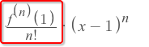
- And it also means the `n=3`, so the coefficient becomes:
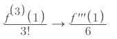
- Let's evaluate the `f'''(1)`:
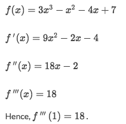
- So the coefficient is:
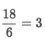

### Example
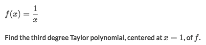
Solve:
- Let's express the Taylor polynomial to the `nth degree` as:
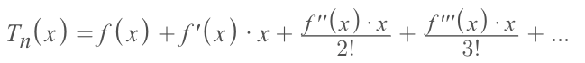
- Since it's asking for the series to the `3rd degree`, then it becomes:
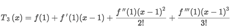
- And we only need to find out every degree of derivatives, and we will get:
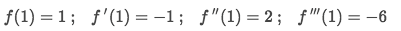
- So the Taylor polynomial then is:
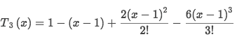

