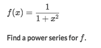
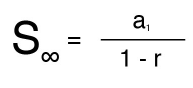
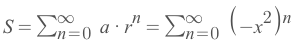
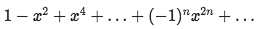

# Function as a 「Geometric Series」

### Example

Solve:
- This function looks very alike the `Infinite Geometric function`:

- So we extract the key numbers out:
    - First term: `a = 1`
    - Common Ratio: `r = -x²`
- So the infinite geometric series would be:

- Expand the formula to be:

