#  ❖ Maclaurin Series of Common functions

[►Refer to Wiki: List of Maclaurin series of some common functions](https://en.wikipedia.org/wiki/Taylor_series#List_of_Maclaurin_series_of_some_common_functions)

Maclaurin series of these common functions are very useful, which we really want to **memorize**.

Function | Maclaurin Series
-- | --
sin(x) | 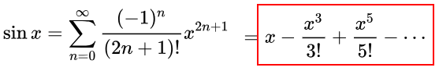
cos(x) | 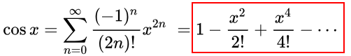
tan(x) | 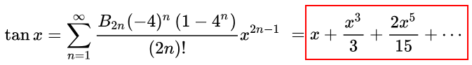
sec(x) | 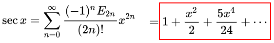
eˣ | 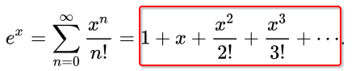
Geometric series 1 | 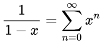
Geometric series 2 | 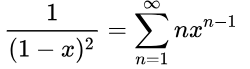
Geometric series 3 | 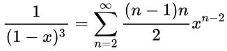

### Example
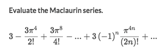
Solve:
- This Maclaurin series has a clear pattern of `cos(x) Maclaurin series`:
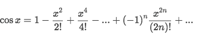
- In this case, it's:
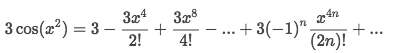
- So we could convert the series back to the trig function:
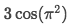

### Example
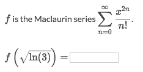
Solve:
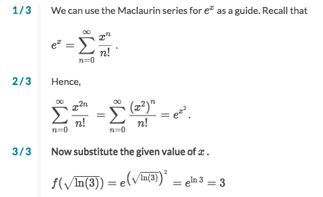

###  Example
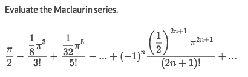
Solve:
- Looks quite a complicated series, but we look at the `factorial dominators`, we found that resembles the pattern of the `sin(x)`'s maclaurin series.
- By comparing to the `sin(x) maclaurin series`, we notice that `x = π/2`, and all the rest are the same.
- So rewrite the series to the function:
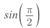
- And we get the result is `1`.

### Example
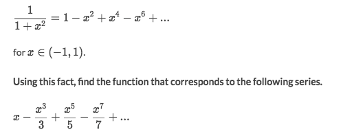
Solve:

