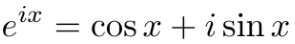
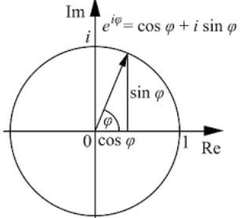
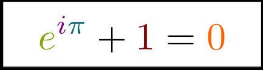

# 「Euler's Formula」 & 「Euler's Identity」

> "The `Euler's identity` connects all of these **FUNDAMENTAL NUMBERS** in some mystical way that shows that there's some connectedness to the UNIVERSE. 
**If this does not blow your mind, you have no emotion.**" - Sal Khan

[▶︎Refer to the most well-known lecture from Sal Khan: Euler's formula & Euler's identity](https://www.khanacademy.org/math/ap-calculus-bc/bc-series-new/modal/v/euler-s-formula-and-euler-s-identity)

▼ `Euler's formula`:

▼ `Euler's identity`:

