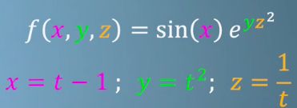

# Total derivatives [DRAFT]

[Refer to Coursera: Differentiate with respect to anything](https://www.coursera.org/learn/multivariate-calculus-machine-learning/lecture/zZrRk/differentiate-with-respect-to-anything)

