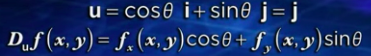
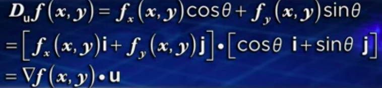
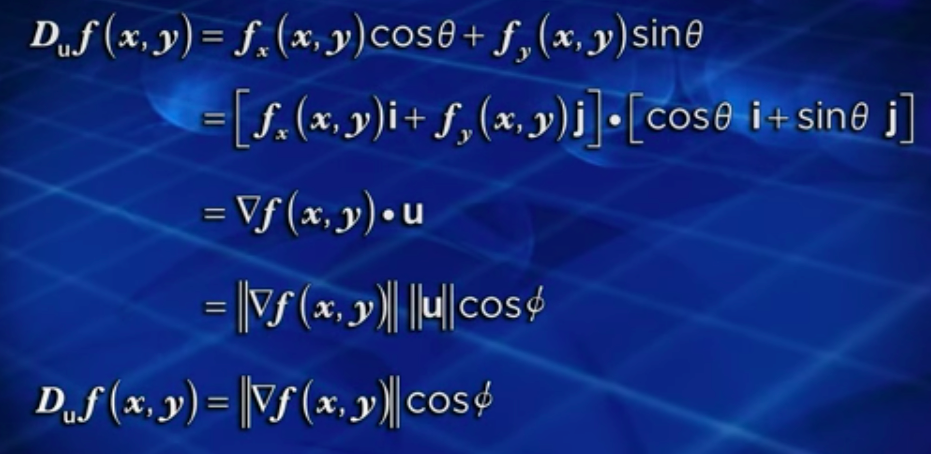
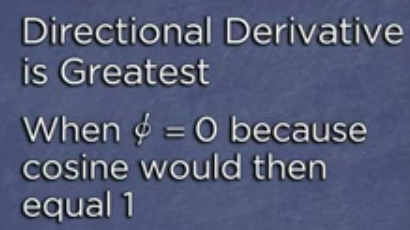
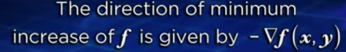

# Directional derivative [DRAFT]

> It is the more general form of the `Partial derivative`, because it not only give the derivatives with respects to axes, but to any direction.

[Refer to Khan academy: Directional derivative](https://www.khanacademy.org/math/multivariable-calculus/multivariable-derivatives/modal/v/directional-derivative)
[Refer to youtube: Directional Derivatives and The Gradient](https://www.youtube.com/watch?v=0XLlw28yKuI)

The `Partial derivatives` **only** give the **SLOPE** in `x direction` and `y direction` and more directions with respect to the variables, but what if we want to have a **SLOPE** in **ANY DIRECTION**?

So the `Directional derivative` comes in place to achieve that.

How to do this:
- Pick a **direction**: We pick the direction `θ`
- Represent the direction by a `unit vector` in form of `u = cosθ·i + sinθ·j`, because `cos²θ + sin²θ = 1`.
- Apply the directional derivative's formula:

(`Dᵤ` means `Directional Derivative of a Unit Vector u`, `f𝓍` means Partial derivative respects to x, and `f𝑦` means `Partial derivative` respects to y.)

The `Directional derivative` is the `Dot product` of `The Gradient & Unit vector`:

Which comes from:

