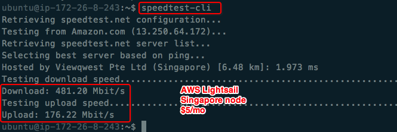
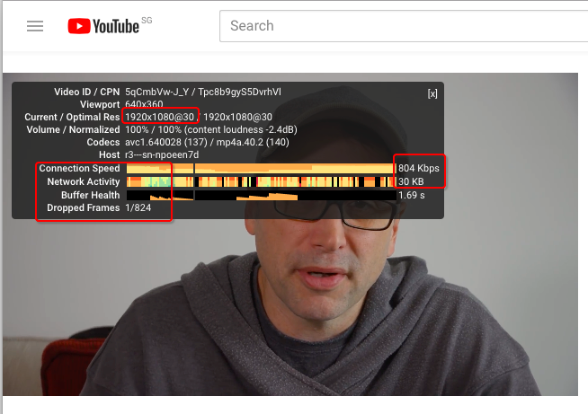
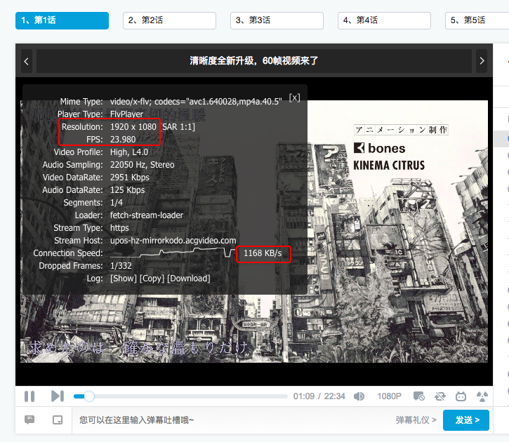

# 各服务商的各国节点测试（不定期更新）
自从今天发现命令行里可以运行ookla的`speedtest`，就赶快到自己的树莓派、国外租的主机查看连接网速。之前一直用shadowsocks觉得网速慢的时候，总是怀疑有可能节点没选好，一会儿东京，一会儿新加坡，一会儿加拿大，可还是有问题。

## AWS Lightsail 主机 -- Singapore 节点
下载速度近500M/s，上传速度150M/s，这是什么级别？!

> 在网上看到过一个帖子说得很对，不管怎么测试，还有什么比Youtube 1080P更有说服力呢？

看到这个，才明白原来服务器本地访问的速度和上传的速度再快，也敌不过传输过程中的丢失。。
另外，我是在本机连接服务器访问youtube的，我本机的测速是15M/s，宽带的带宽是100M。

此时我本机访问bilibili视频的速度比访问youtube快了一倍，如下：

